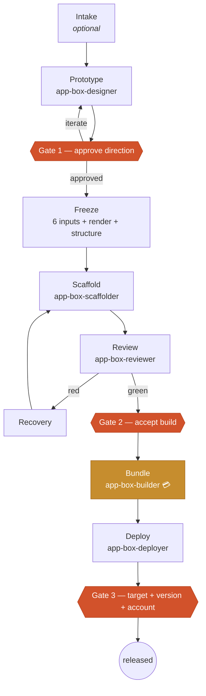
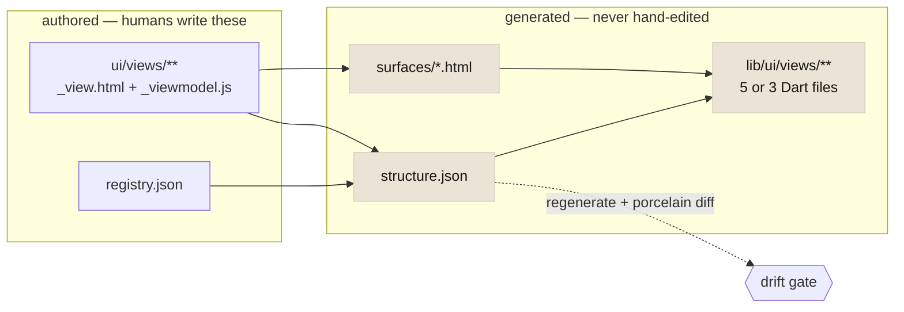
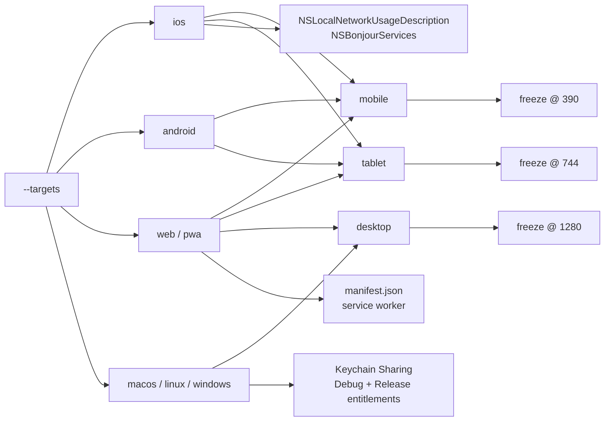
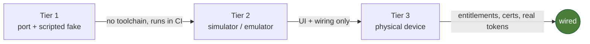

# Flows

Diagrams only. Narrative lives in [journeys.md](journeys.md); the surface
inventory in [brief.md](brief.md).

## The pipeline, with its three human gates

💳 = the licence precondition. It runs **before** the phase and fails with a
licence message — never as a gate going red (§17).

## Where a feature's truth lives

Every CRUD operation writes to the **authored** box only. The drift gate exists
because `structure.json` is a pure function of the authored side — see
[feature-crud.md](../plans/feature-crud.md).

## Targets derive viewports and ceremonies

Viewport set is the **union**; mobile is always present. Freeze widths sit
*inside* each MD3 window size class, never on the 600/840 boundaries.

## The three test tiers

A provider may only be **advertised at the tier it has passed**. See
[stub-remediation.md](../plans/stub-remediation.md).
