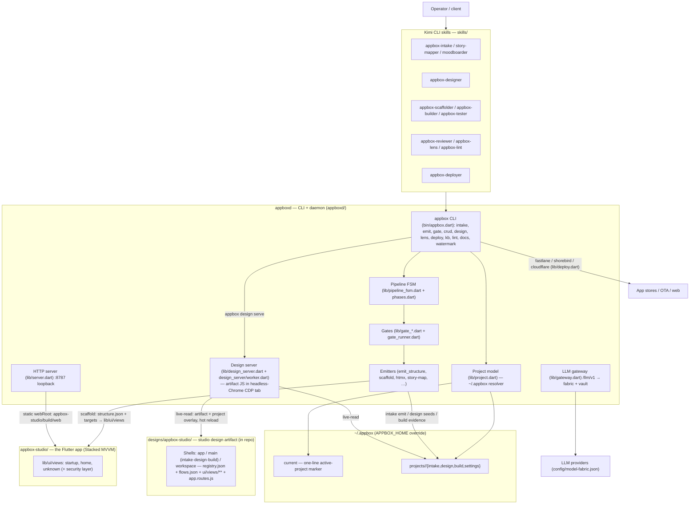
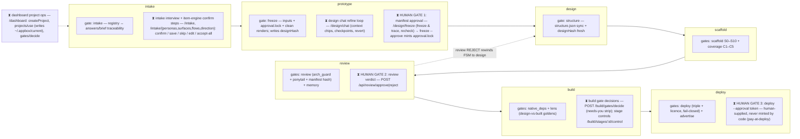
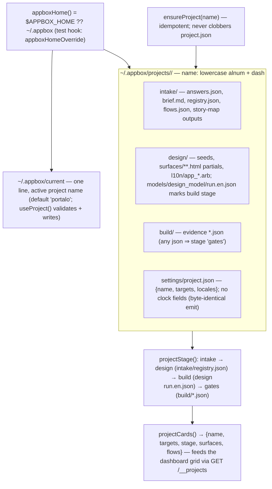
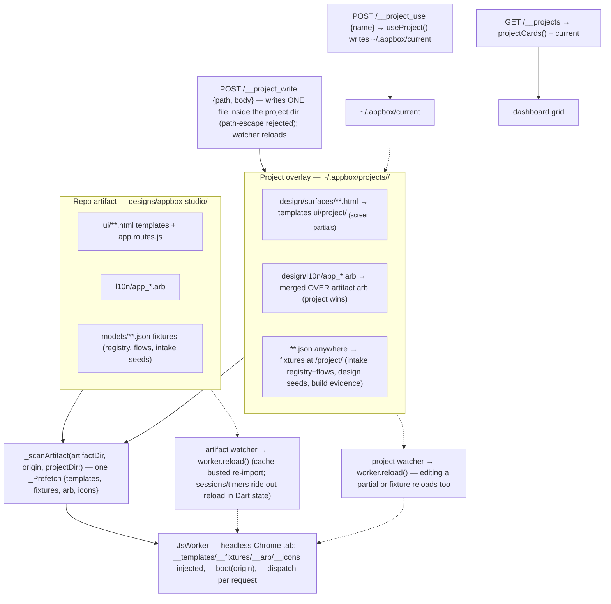
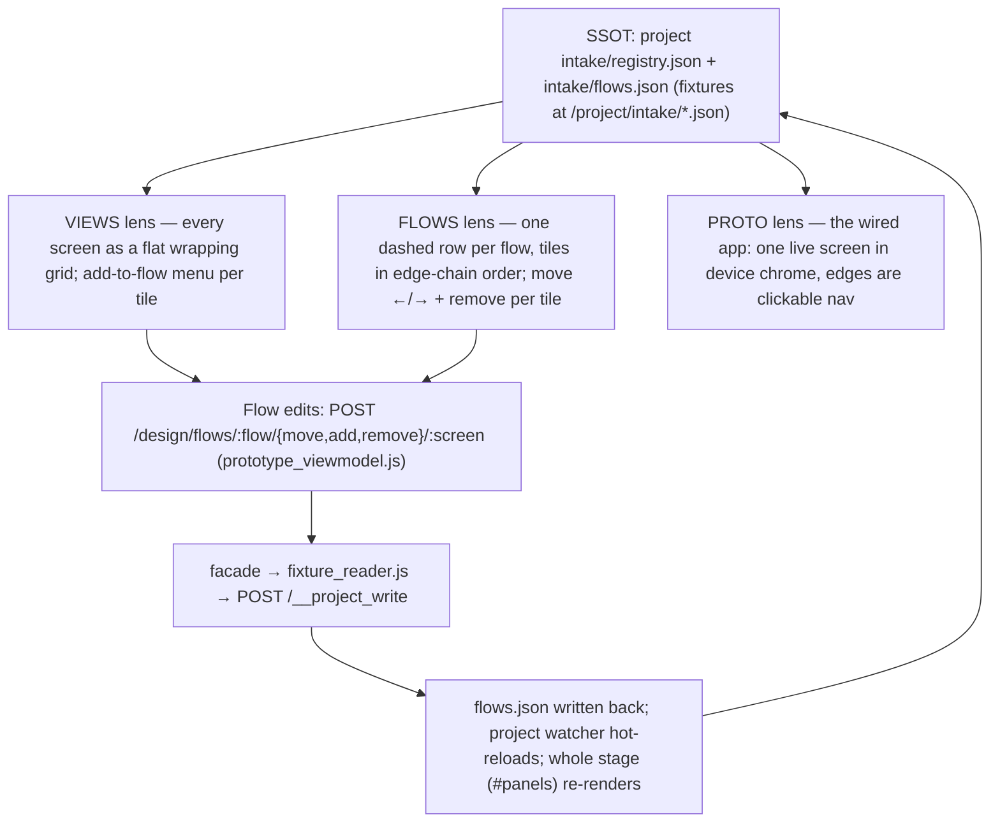

# appbox — System Map

One visual reference for the whole repo. Every node and edge traces to a file.
Canonical terms per `docs/VOCABULARY.md`. Verified against the code 2026-08;
`(planned)` marks wiring that is designed but not built.

## 1. System overview

The operator drives Kimi CLI skills; skills drive the `appbox` CLI and `appboxd`.
The design server renders the studio artifact (`designs/appbox-studio/`) plus a
live overlay of the current user project (`~/.appbox/projects/<name>/`). The
Flutter app (`appbox-studio/`) is the product shell — today it implements only
`startup`/`home`/`unknown`; the full surface set exists in the design artifact.



## 2. Pipeline stages and user-interaction checkpoints

FSM phase order (`lib/phases.dart`): intake → prototype → design → scaffold →
review → build → deploy, with per-phase gates (`phaseGates`). Human checkpoints
an agent can reach but never pass are marked ⧗; the studio design surfaces where
they happen are named under each.



Also on the CLI outside the phase loop: gates `arch`, `gen-freshness`, `trace`,
`tier1`, `capability`, `api-map`; emitters `structure`, `htmx`, `playground`,
`synthesize`, `blueprint`, `story-map`, `scaffold`; `kb`, `lint`, `docs`,
`watermark`.

## 3. The ~/.appbox project model

User projects live outside the repo (`lib/project.dart`). The studio's own
design stays in `designs/appbox-studio/`; `~/.appbox` holds user projects only.
Stage is derived deterministically from which outputs exist — never stored.



## 4. Design server: live-read wiring (artifact + project overlay)

`appbox design serve <dir|name>` (`lib/design_cli.dart` →
`lib/design_server.dart`) runs the artifact's ES-module JS in a headless-Chrome
tab over CDP (`design_server/worker.dart`). Dart owns HTTP/sessions/timers; the
worker tab owns viewmodel dispatch + Nunjucks render. `_scanArtifact` prefetches
everything into sync in-memory maps; two file watchers hot-reload the worker.



## 5. Design viewer: three lenses, one SSOT

`ui/common/design_viewer.html` is the shared screen stage. All three lenses
render from the same source of truth — `registry.json` (screens) + `flows.json`
(flow edges) of the current project, live-read through the overlay. Mode
`v.mode`: `views` (default) | `flows` | `proto`.



## 6. Intake chain and studio boot chain

Intake (`lib/intake.dart`, `lib/intake_cli.dart`): answers carry per-field
provenance (`client | founder | inferred`); `inferred` fields are visibly marked
in the brief (`> **[inferred]**`) and derived flows get `provenance: inferred`
so the confirm step has something to confirm. The studio app shell
(`ui/views/app_shell/`, `routes.app.js`) is the boot chain; root lands on the
dashboard, whose project grid is live from `~/.appbox`.

```mermaid
sequenceDiagram
    autonumber
    participant H as Human
    participant S as Studio (design server)
    participant C as appbox CLI
    participant P as ~/.appbox/projects/<name>/intake/

    H->>S: /intake interview (answer / skip / depth)
    S->>C: appbox intake emit --answers a.json --project <name>
    C->>C: validate {value, provenance} per field; deriveComp/deriveRoute (mechanical naming only)
    C->>P: write answers.json + brief.md + registry.json + flows.json (undeclared flows derived as inferred)
    C->>C: appbox emit story-map — unified brief (renderBriefSections answers path) → story-map.json
    H->>S: item-engine steps personas/surfaces/flows/direction: confirm / save / skip / edit / accept-all
    H->>C: appbox intake flows confirm --project <name> --flow <id> --as founder|client (derive + confirm)
    C->>P: flip flow provenance in flows.json
    Note over H,S: boot chain: / →303 /dashboard; /splash auto-advances → /startup → /auth (POST /auth/signin) → /dashboard
    S->>S: /dashboard grid ← GET /__projects (projectCards); use → POST /__project_use; new → POST /dashboard/projects creates REAL project, lands on /intake
```

## 7. Glossary (as used in the diagrams)

- **Authored layer** — `registry.json` + `flows.json` + `ui/views/**` +
  `app.routes.js`; written by intake emit and the design surfaces.
  **Generated**: `structure.json`, `appbox-studio/lib/**` — emitters only.
- **Gate** — isolated assertion unit; exits pass / fail / not-applicable (exit
  2); never calls a sibling gate. **Human Gate** — prototype approval, review
  verdict, deploy approval token: an agent can reach, never pass.
- **Freeze / designHash** — freeze PASS records sha256 of the design tree;
  structure/scaffold/coverage re-assert freshness. `approval.lock` is minted
  only by `freeze --approve`.
- **Provenance** — `client | founder | inferred` on every intake field and
  flow; `inferred` = not elicited, must be confirmed (`intake flows confirm`).
- **Project overlay** — the design server's live read of the current
  `~/.appbox` project merged over the repo artifact (§4); project l10n wins,
  project JSON serves at `/project/<rel>`.
- **Targets** — platform set in `settings/project.json` /
  `config/appbox.config.json`; derives viewport rungs (390/744/1280) and
  scaffold file counts.
- **Pay-at-Deploy** — licence (Ed25519, offline-verified) hard-blocks first
  deploy; everything before is free; `APPBOX_DEV_LICENCE=1` dev bypass.
- **Stub** — unimplemented provider that throws by design; never offered
  (fugu fabric provider — optional catalog entry, no endpoint yet). The
  vercel deploy target was one until 2026-08-01, when `261b2ad` made it real
  (live smoke tests in `93cf1ef`).
