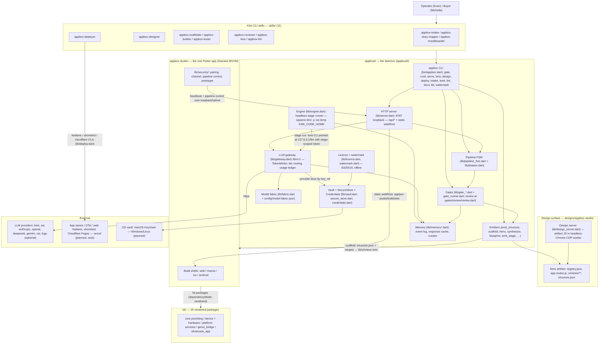
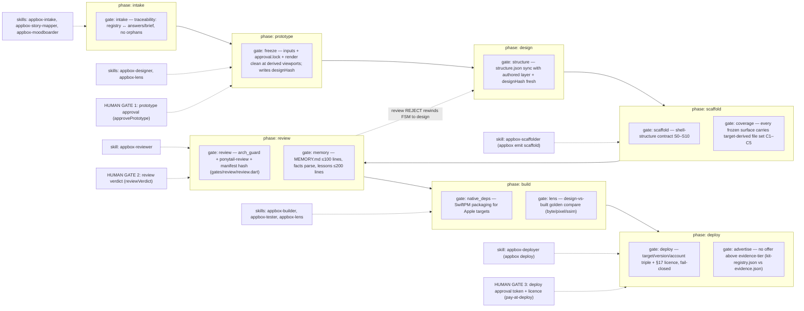
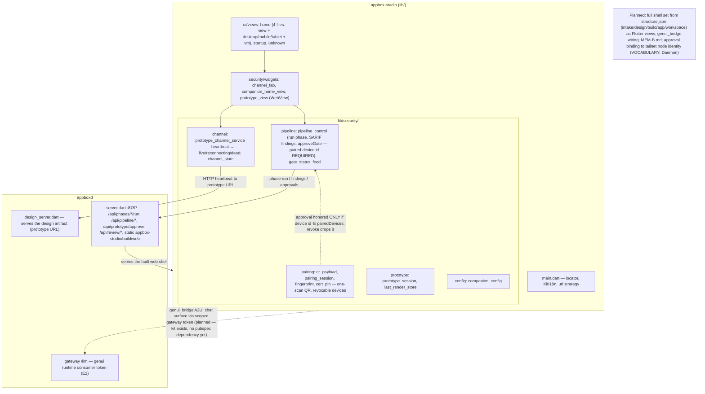

# appbox — System Map

One visual reference for the whole repo. Every node and edge traces to a file;
`(planned)` marks wiring that is designed but not built. Canonical terms per
`docs/VOCABULARY.md`; build order per `docs/plans/architecture.md` §21.

## 1. System overview

The operator drives Kimi CLI skills; the skills drive the `appbox` CLI and the
`appboxd` daemon; the daemon owns the pipeline FSM, gates, emitters, memory,
vault/licence, and the loopback LLM gateway that fronts all provider traffic.



## 2. Pipeline stages, gates, and skills

Phase order from `lib/phases.dart` / `lib/pipeline_fsm.dart`
(intake → prototype → design → scaffold → review → build → deploy); gates per
phase from `phaseGates`; the standalone gate suite order (`gateOrder` in
`lib/gate_runner.dart`) is intake, freeze, structure, scaffold, coverage,
memory, advertise, review, native_deps, lens, deploy.



Also on the CLI but outside the phase loop: `arch`, `gen-freshness`, `trace`,
`tier1`, `capability`, `api-map` gates (target-driven, bypass repo-root
discovery); emitters `structure`, `htmx`, `playground`, `transform_tokens`,
`synthesize`, `blueprint`, `emit_stage`, `generate_view`, `theme-map`,
`palette`, `story-map`, `scaffold`; `kb` (facts/build/check/lock/playbook/
conventions), `lint`, `docs`, `watermark`.

## 3. User-interaction checkpoints — a full run

Every point a human must act. Gates an agent can reach but never pass are
marked HUMAN GATE; the FSM enforces them via `humanApproved` / `approvalTokens`
/ review state in `pipeline/state/default.state.json`.

```mermaid
sequenceDiagram
    autonumber
    participant H as Human (operator / client)
    participant S as Kimi CLI + skills
    participant C as appbox CLI
    participant D as appboxd (server + FSM + engine)
    participant G as Gates
    participant L as LLM gateway → providers

    H->>S: intake a project (answers elicitation questions)
    S->>C: appbox intake emit --answers …
    C->>C: write docs/design/brief.md + registry seed (pure function of answers)
    C->>G: gate intake (traceability answers/brief ↔ registry)
    S->>S: story-mapper / moodboarder (optional pre-design)
    S->>C: appbox design serve (design_server over CDP worker)
    H->>S: reviews rendered prototype in browser; requests changes
    loop design iteration
        S->>C: CRUD on authored layer (appbox crud …)
        Note over C: delete and verify --fix REQUIRE --confirm (§18)
        C->>G: gate freeze (render every surface at derived viewports)
    end
    H->>C: freeze --approve (HUMAN GATE 1: mints design/approval.lock)
    C->>D: POST /api/prototype/approve (or FSM approvePrototype)
    D->>D: record designHash + humanApproved.prototype in default.state.json
    D->>D: advance guard: prototype gate passed AND humanApproved
    S->>C: emit structure → structure.json; gate structure (designHash fresh)
    S->>C: emit scaffold → lib/ui/views tree per targets
    C->>G: gates scaffold + coverage
    S->>S: appbox-builder fills view/VM bodies; appbox-tester TDD
    D->>L: engine stage runs: kimi -p with stage-scoped token, tier from fabric
    L-->>D: response + usage.jsonl + llm_request event
    S->>C: gate review + gate memory
    H->>D: POST /api/review/approve|reject (HUMAN GATE 2)
    alt reject
        D->>D: FSM rewinds to design phase, rejections + 1
    else approve
        D->>D: review.approved = true; isDone when not dirty
    end
    S->>C: gates native_deps + lens (design-vs-built vs goldens)
    H->>C: licence present? (pay-at-deploy — everything before is free)
    C->>G: gate deploy: licence assertion FIRST (fail-closed; APPBOX_DEV_LICENCE=1 dev bypass)
    H->>C: appbox deploy deploy --target T --version V --account A --approval <tok> (HUMAN GATE 3)
    C->>C: deploy mechanics (fastlane/shorebird/cloudflare); append deploy-ledger.json
    Note over C: deploy.dart never mints the approval token — the human supplies it
```

## 4. Data and state wiring

Who writes, who reads. Runtime state lives in `pipeline/state/` (gitignored);
curated memory in `memory/`; catalogs in `config/`.

```mermaid
flowchart TD
    subgraph state["pipeline/state/"]
        st_state["default.state.json — FSM: phase, phaseStatus, humanApproved, approvalTokens, designHash, review, dirty (schema 4)"]
        st_runs["runs/<run_id>.json — per-stage RunManifest"]
        st_runsjsonl["runs.jsonl — FSM audit trail"]
        st_score["scorecard.jsonl — per stage run (stage, tier, tokens, gate_pass, cache_hit)"]
        st_usage["usage.jsonl — per gateway call (consumer, tier, provider, model, tokens)"]
        st_events["memory/events.jsonl — raw MemoryEvent log (rotates ~50MB)"]
        st_cache["memory/cache/*.json — exact-match LLM response cache (FNV key, 24h TTL, 500 cap)"]
        st_intake["default.intake.json — intake answers"]
        st_targets["targets.derivation.json — targets → viewports/form-factors/ceremonies"]
        st_ledger["deploy-ledger.json — every deploy attempt, incl. halted"]
    end

    subgraph mem["memory/ (curated)"]
        mem_index["MEMORY.md — index, ≤100 lines"]
        mem_facts["facts/*.json — durable {fact, source, ts}"]
        mem_lessons["stages/<stage>.LESSONS.md — ≤200 lines, written ONLY on observed gate failure"]
    end

    subgraph cfg["config/"]
        cfg_app["appbox.config.json — targets, viewports 390/744/1280, escalationLimit, dependencyMode"]
        cfg_fabric["model-fabric.json — providers, tiers frontier/standard/fast, stage tiers, escalation rule"]
        cfg_evid["evidence.json — advertise evidence ledger (suite-written only)"]
        cfg_reg["kit-registry.json — kit capabilities, phase, verification tier"]
        cfg_rules["forbidden_abs_prefixes.txt / stripped_names.txt — lint rules"]
    end

    subgraph design2["designs/appbox-studio/ (authored layer)"]
        d_reg["models/screens_model/registry.json + migrations.json"]
        d_views["ui/views/** + app.routes.js"]
        d_struct["structure.json (GENERATED by emit_structure)"]
        d_lock["approval.lock (minted by freeze --approve)"]
        d_brief["docs/design/brief.md + story-map.json"]
    end

    fsm2["pipeline_fsm.dart"] -->|writes| st_state
    fsm2 -->|appends| st_runsjsonl
    srv2["server.dart /api/pipeline/*"] -->|reads/writes via FSM| st_state
    eng2["engine.dart runStage"] -->|writes| st_runs
    eng2 -->|appends| st_score
    eng2 -->|stage_run events| st_events
    eng2 -->|reads/writes| st_cache
    eng2 -->|on gate fail ONLY| mem_lessons
    gw2["gateway.dart"] -->|appends| st_usage
    gw2 -->|llm_request events| st_events
    gw2 -->|reads| cfg_fabric
    eng2 -->|stage tiers| cfg_fabric
    analytics["memory_analytics.dart (read-only) → /api/memory/briefing"] -->|reads| st_score
    analytics -->|reads| st_usage
    analytics -->|reads| st_events
    curator["memory_curate.dart (sole lesson writer)"] --> mem_lessons
    kbfacts["appbox kb facts (kit_facts.dart)"] -->|writes| mem_facts
    g_mem2["gate memory"] -->|asserts| mem_index
    g_mem2 -->|asserts| mem_facts
    g_mem2 -->|asserts| mem_lessons
    intake2["intake.dart emit/seed"] -->|writes| st_intake
    intake2 -->|writes| d_brief
    intake2 -->|seeds| d_reg
    crud2["crud.dart (the one authored-layer write path)"] -->|writes| d_reg
    crud2 -->|writes| d_views
    emit2["emit_structure.dart"] -->|reads| d_reg
    emit2 -->|reads| d_views
    emit2 -->|writes| d_struct
    freeze2["gate freeze"] -->|writes on PASS| st_state
    freeze2 -->|--approve mints| d_lock
    freeze2 -->|viewport widths| cfg_app
    freeze2 -->|derived widths| st_targets
    g_struct2["gates structure/scaffold/coverage"] -->|assert designHash fresh| st_state
    g_struct2 -->|read| d_struct
    scaf2["scaffold.dart emit"] -->|reads structure.json + targets| d_struct
    scaf2 -->|writes lib/ui/views tree| studio2["appbox-studio/lib/"]
    g_adv["gate advertise"] -->|reads| cfg_evid
    g_adv -->|reads| cfg_reg
    deploy2["deploy.dart"] -->|appends| st_ledger
    g_dep["gate deploy"] -->|asserts triple + licence| st_state
    lint2["appbox lint"] -->|reads| cfg_rules
    allgates["all gates"] -->|targets/viewports, never literals| cfg_app
    studio2 -.->|"MEM-B.md travels with the app (planned — architecture §4, not built)"| mem
```



## 5. appbox-studio wiring

One Flutter app (Stacked MVVM, `app.router/locator/dialogs/bottomsheets`),
four build shells. The security layer pairs devices and remote-controls the
pipeline; l10n ships en + pl. The full five-shell surface set exists only in
the design artifact so far — the Flutter app today implements `home`,
`startup`, `unknown` views plus the security widgets.



## 6. Glossary (as used in the diagrams)

Phases (FSM order, `lib/phases.dart`):

- **intake** — elicitation only; emits brief + registry seed, never design or
  code (`lib/intake.dart`). Gate: intake (traceability).
- **prototype** — the htmx design artifact is built and frozen. Gate: freeze
  (inputs, `approval.lock`, clean renders at derived viewports; records
  `designHash`).
- **design** — structure derivation. Gate: structure (`structure.json` in sync
  with the authored layer, hash-fresh).
- **scaffold** — per-surface Flutter file emission; form factors follow
  targets. Gates: scaffold (shell contract S0–S10), coverage (C1–C5).
- **review** — QC. Gates: review (arch_guard + ponytail-review + manifest
  hash), memory (curated-memory caps).
- **build** — fill + verify. Gates: native_deps (SwiftPM packaging), lens
  (design-vs-built goldens, byte/pixel/ssim; console errors auto-fail).
- **deploy** — ship. Gates: deploy (target/version/account triple + §17
  licence, fail-closed), advertise (no offer above evidence tier).

Terms:

- **Gate** — isolated self-tested assertion unit; exits pass / fail /
  not-applicable (exit 2, `envExit`); never calls a sibling gate.
- **Human Gate** — one of three approvals an agent can reach but never pass:
  prototype approval (`approvePrototype`), review verdict (`reviewVerdict`),
  deploy approval token (`deploy --approval`, never minted by code).
- **Freeze / designHash** — hash-locked approval: PASS records sha256 of the
  design tree into `state.designHash`; structure/scaffold/coverage re-assert
  freshness (§6).
- **Authored layer** — `registry.json` + `ui/views/**` + `app.routes.js`;
  written only by intake seed and `crud`. **Generated**: `structure.json`,
  `lib/**` — written only by emitters.
- **Targets** — platform set in `config/appbox.config.json`; derives viewport
  rungs (390/744/1280), scaffold file counts, ceremonies via
  `targets.derivation.json`.
- **Golden** — frozen capture the lens gate compares the built app against;
  recapture only via the approval-pattern path.
- **Model fabric** — `config/model-fabric.json`: providers (key_ref → vault),
  tiers (frontier/standard/fast), stage→tier pins, escalation (gate fail → one
  tier up, bounded once, never silent downgrade).
- **Scoped token** — in-memory per-consumer gateway token (`abx_…`) listing
  the tiers it may request; dies with the daemon (persistence/revocation:
  planned).
- **Scorecard / usage ledger** — `pipeline/state/scorecard.jsonl` (per stage
  run) and `usage.jsonl` (per gateway call); tokens null when unknown, never
  fabricated; cost null until fabric pricing wiring lands.
- **Memory (M1)** — deterministic writers append raw events
  (`memory/events.jsonl`); curated lessons promoted only on observed gate
  failure; caps enforced by the memory gate. **MEM-B** (`output/MEM-B.md`
  travelling with the app): planned, not built.
- **Pay-at-Deploy** — licence (Ed25519, offline-verified, annual/perpetual,
  30-day grace) hard-blocks first deploy; everything before is free;
  `APPBOX_DEV_LICENCE=1` is the documented dev bypass.
- **Stub** — unimplemented provider that throws by design; never offered
  (vercel deploy target; fugu fabric provider with `base_url: null`).
