# Moodboard — AI App Builders & Flows Canvas

**Slice:** AI app builders + design-canvas/flows tools, curated for appbox's FLOWS CANVAS feature (captured screenshots of the built app + rendered designs arranged as connected user flows on an infinite canvas).
**Pipeline context:** story-map → design → flows-canvas → build, with 3 human approval gates. Users: solo founder + indie dev evaluator. Bar: best-in-class, "too mediocre" was rejected.
**Researched:** 2026-07-28, sources from 2025–2026. Freshness: 🔥 current/bleeding edge · 🌡️ established, still shipping · ❄️ legacy.

---

## 1. Dreamflow — tri-surface agentic ↔ visual ↔ code

- **URL:** https://dreamflow.app/ · docs https://docs.dreamflow.com/ · launch coverage [PR Newswire, 2025-07](https://www.prnewswire.com/news-releases/flutterflow-introduces-a-smarter-dreamflow-ai-first-with-tri-surface-development-302512152.html)

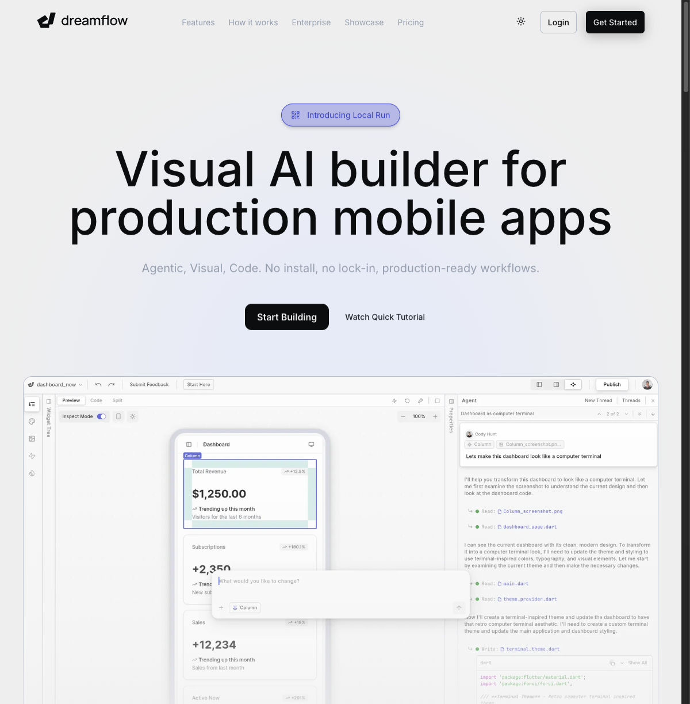
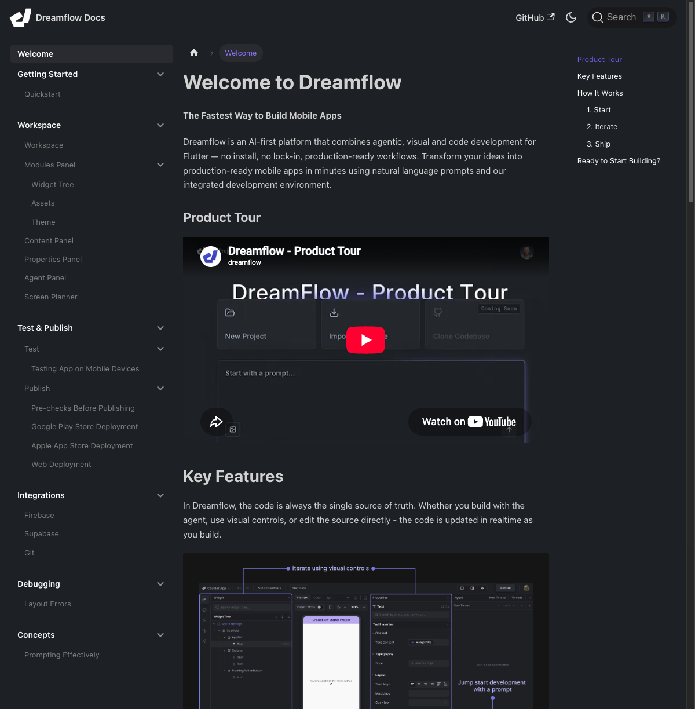

- **Steal these patterns:**
  - **Tri-pane with three live-synced surfaces** — agent chat, visual canvas (widget tree + properties editor with typed values/expressions), and full code editor. Edit any one surface, the other two update. appbox's builder UI should treat the flows canvas as a *fourth* synced surface, not a separate export.
  - **Real-time preview that refreshes as layout changes** — no "run" button between canvas edit and rendered app.
  - **No-lock-in file-system access** — the visual layer edits real project files, which is exactly appbox's daemon + emitted-Flutter-target story.
- **Why appbox:** Dreamflow is the closest structural sibling (Flutter-native, AI-first, browser builder). Its tri-surface sync is the bar for appbox's gates: the founder should be able to look at the flows canvas and know it reflects the *actual built target*, not a stale mock.
- **Freshness:** 🔥 (Dreamflow 2.0 tri-surface shipped Jul 2025; active through 2026)

## 2. FlutterFlow — editor + preview + design system library

- **URL:** https://flutterflow.io/ · design system docs https://docs.flutterflow.io/concepts/design-system/ · release cadence [community "What's New"](https://community.flutterflow.io/c/whats-new-in-flutterflow)

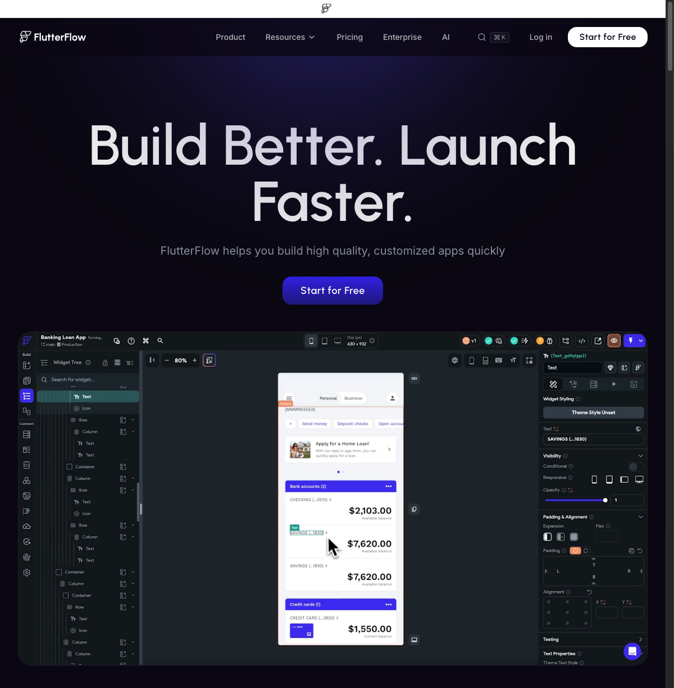
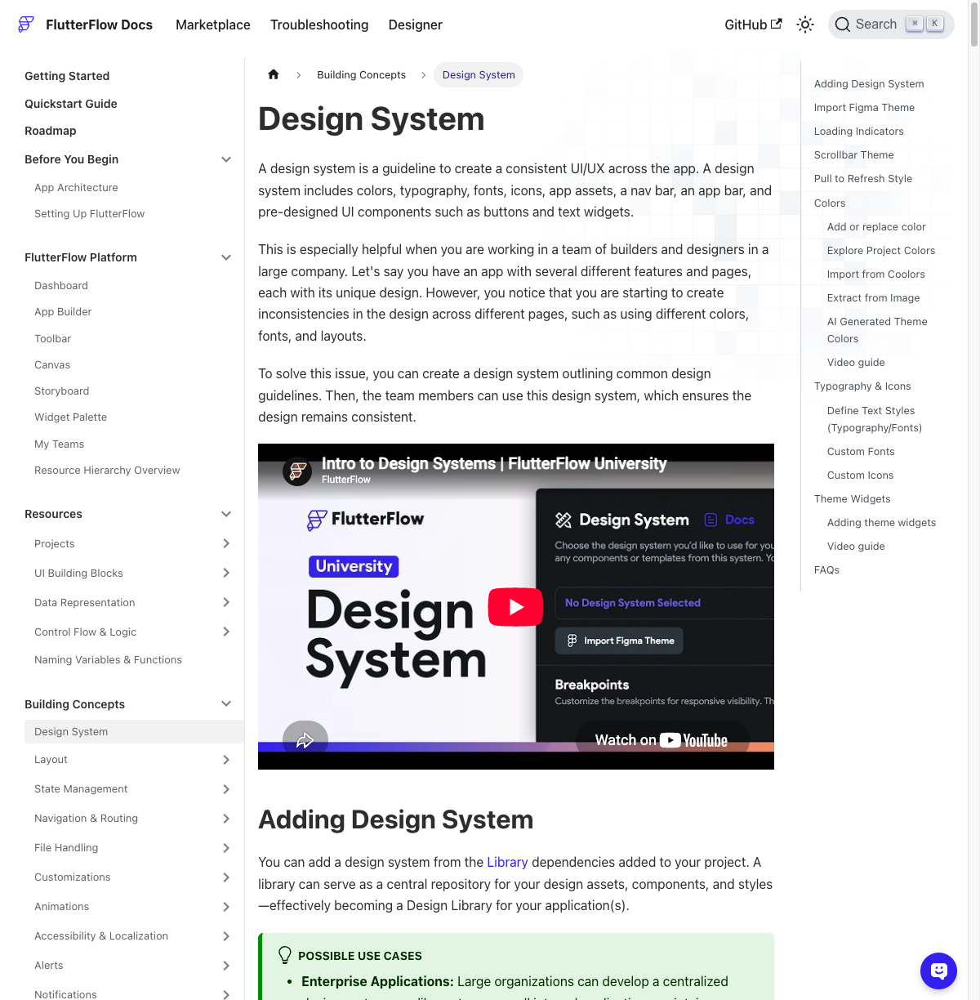

- **Steal these patterns:**
  - **Page-list rail + canvas + properties inspector** — the classic three-column builder anatomy: pages/nav on the left, WYSIWYG canvas center, typed property panel right.
  - **Design Library panel** — global colors, typography scales, reusable component styles with light/dark theme variants in one place; appbox already has theme/primitive layers, so surface them as a first-class panel.
  - **Instant/live preview culture** — every 2025 release note pushes "see it as you type it" (live previews even for date formats). Nothing in appbox's canvas should require a rebuild to reflect state.
- **Why appbox:** FlutterFlow is the incumbent the indie-dev evaluator already knows. Matching its editor anatomy makes appbox legible in 30 seconds; the flows canvas is then the differentiator FlutterFlow *doesn't* have (it shows pages, not connected captured flows).
- **Freshness:** 🌡️ (shipping monthly through 2025–2026, but the core editor UX is 2021-era)

## 3. v0 / Lovable / Bolt.new — the chat-to-app trio

- **URLs:** https://v0.dev/ · https://lovable.dev/ · https://bolt.new/ · 2025 comparisons: [digitalapplied.com](https://www.digitalapplied.com/blog/v0-lovable-bolt-ai-app-builder-comparison), [viralpatelstudio.in](https://viralpatelstudio.in/blogs/ai-ui-generators-v0-bolt-lovable-ux-designers-2025)

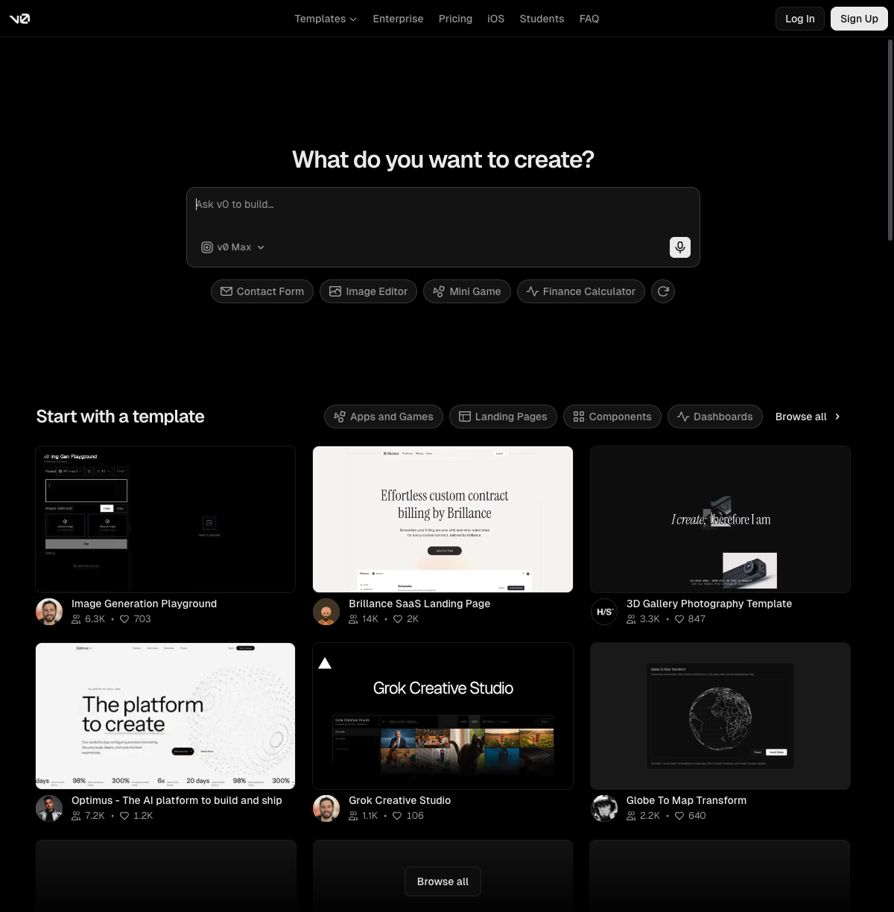
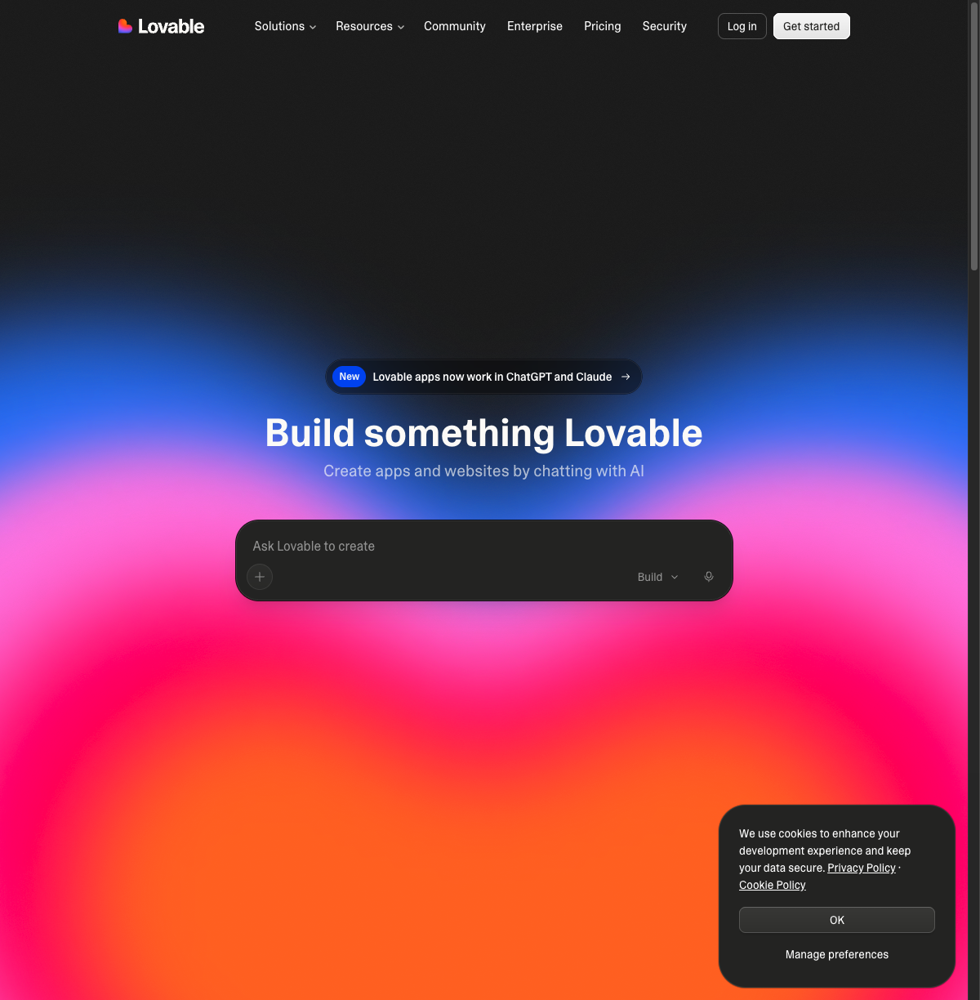
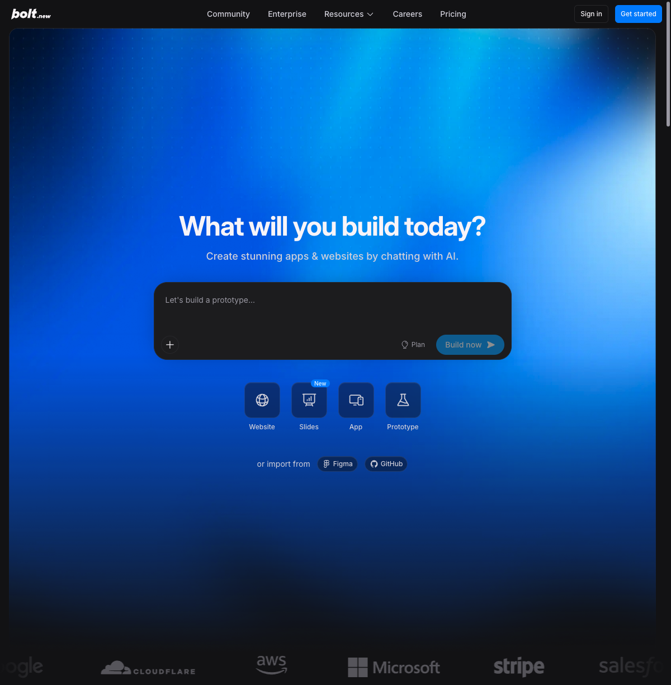

_(capture failed: live split-view preview / generation timelines sit behind each tool's login — homepages show the prompt entry only)_

- **Steal these patterns:**
  - **Split view: prompt/chat thread left, live running preview right** — the now-standard AI-builder layout. Lovable adds click-to-edit *on the preview itself* (select an element in the running app, describe the change).
  - **Generation timeline** — v0's versioned checkpoints per prompt, letting you roll back to any prior render. appbox's gate history (approve/reject/regenerate) should look like this.
  - **Zero-setup preview** — Bolt's WebContainer runs the app in-browser instantly; for appbox the equivalent is the daemon hot-serving the built Flutter web target with no manual step.
- **Why appbox:** These set the user's mental model of "AI builds, I watch it live." appbox inherits the split-view expectation but must beat them on *collections*: all three are single-preview tools with no way to see 20 screens of a flow side by side. That's appbox's opening.
- **Freshness:** 🌡️ (category-defining in 2024–2025, now table stakes — which is precisely why appbox must go beyond them)

## 4. Figma — canvas, prototyping connections, Figma Make

- **URL:** https://www.figma.com/ · https://www.figma.com/make/ · Config 2025 recaps: [Muzli](https://muz.li/blog/muzli-recap-the-highlights-from-figma-config-2025/), [Outwitly](https://outwitly.com/blog/figma-config-recap-2025/) · feature overview image: [Figma 2025 overview](https://aiintro.space/wp-content/uploads/2025/06/Figma_2025_New_Feature_Overview.webp)

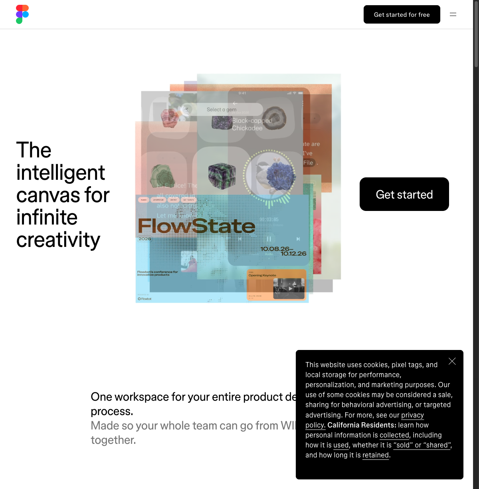
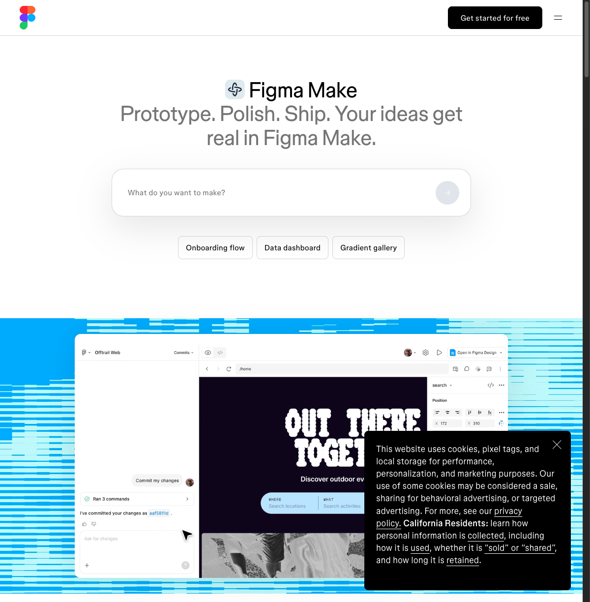

_(capture failed: prototype-mode connector noodles live inside the Figma editor, which requires login)_

- **Steal these patterns:**
  - **Prototype-mode connector noodles** — drag from a hotspot on one frame to another frame; arrows render as bezier curves with labels ("on tap →"). This is *the* reference implementation of flow connections between screens on a canvas.
  - **Zoom-semantic canvas** — frames are crisp thumbnails zoomed out, full-fidelity zoomed in; minimap + section grouping ("Onboarding", "Checkout") keep 100+ screens navigable.
  - **Make's prompt-to-prototype inside the canvas** — AI generation lands as frames *on the same canvas* as manual work, not in a separate app. appbox: generated designs and captured app screenshots must be first-class citizens of one canvas.
- **Why appbox:** Figma owns the muscle memory for "screens on infinite canvas connected by arrows." The flows canvas should feel like Figma prototype view, but the frames are living captures from the built target.
- **Freshness:** 🔥 (Config 2025: Make, Sites, Draw, Buzz — aggressively current)

## 5. Overflow — user-flow diagrams built from screens

- **URL:** https://overflow.io/ · building diagrams: [Overflow Learn Center](https://support.overflow.io/hc/en-us/articles/360023050553-Building-Overflow-diagrams) · AI connector auto-suggestion: [figr.design 2026](https://figr.design/blog/ai-tools-for-ux-design)

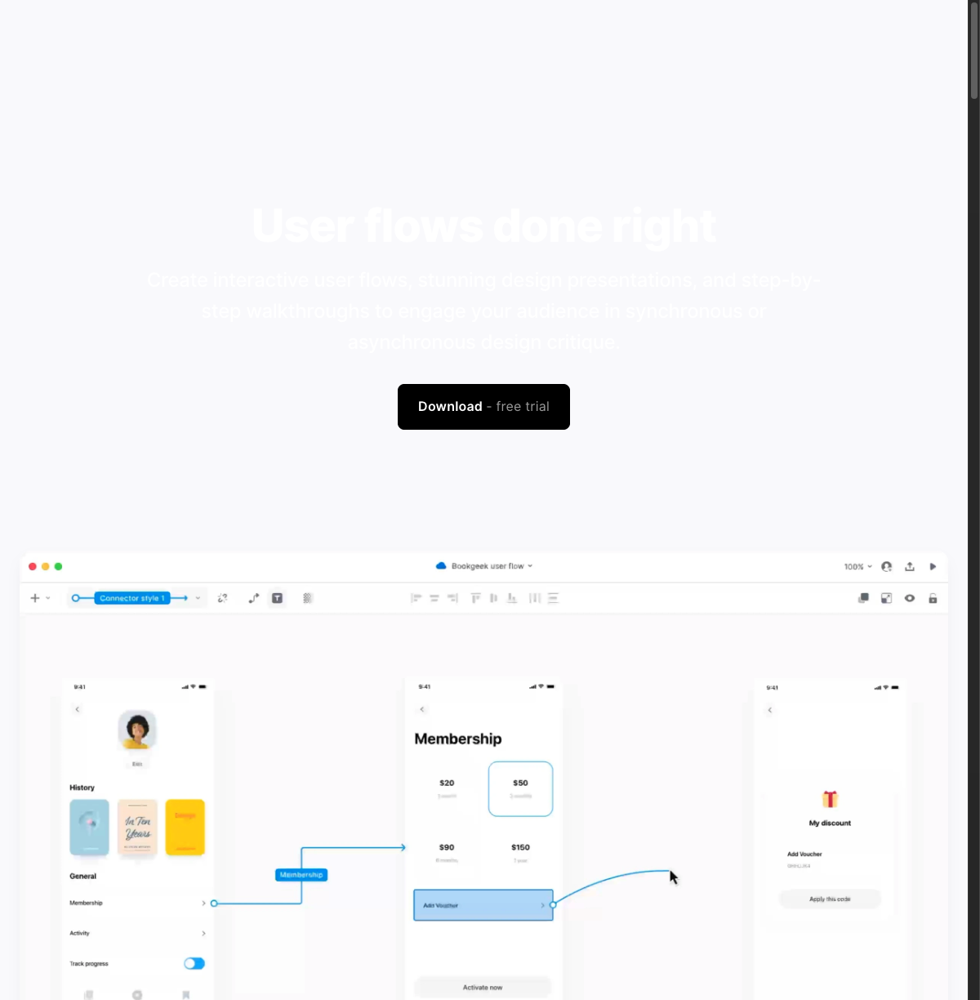
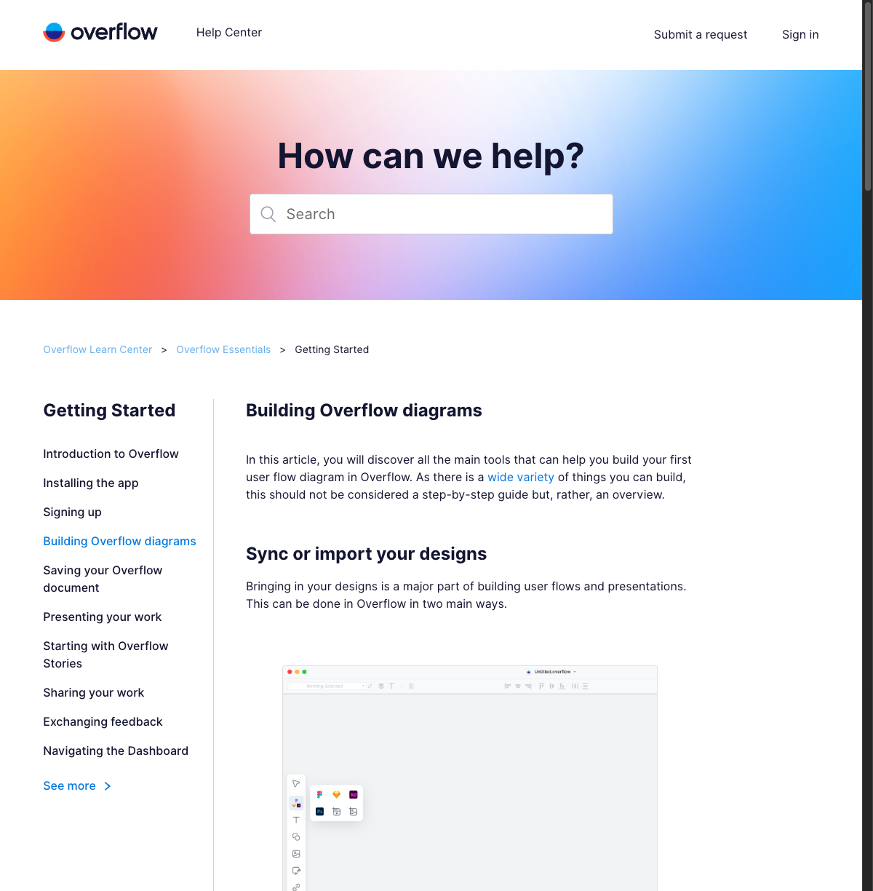

- **Steal these patterns:**
  - **Screen-thumbnail flow arrows for user journeys** — the canonical pattern: real artboard thumbnails tiled on a canvas, connectors dragged from "magnets" on screen edges, each connector labelable with the action. This is almost literally appbox's flows canvas.
  - **Playable walkthrough mode** — present the flow as a guided step-through path, not just a static diagram. appbox approval gates could present "walk the signup flow" to the founder exactly like this.
  - **AI-suggested connections** — Overflow now suggests links between screens from component names/patterns; appbox can infer connections from actual navigation in the built app (stronger: truth, not guesses).
  - **Branded presentation themes** — the diagram itself is client-presentable, matching appbox's agency/client-brief positioning.
- **Why appbox:** Overflow validates that screen-collections + connections is a standalone product category. appbox's edge: Overflow syncs from static design files; appbox syncs from the *built app*, so flows can never drift from shipped reality.
- **Freshness:** 🌡️ (category standard for years; AI-assisted connectors keep it relevant in 2026)

## 6. MagicPath — AI generation directly on an infinite canvas

- **URL:** https://magicpath.ai/ · docs https://www.magicpath.ai/documentation · 2026 reviews: [flowstep.ai](https://flowstep.ai/blog/magicpath-pricing/), [moonchild.ai](https://moonchild.ai/blog/magicpath-vs-moonchild-ai-comparing-ai-design-tools-for-product-designers) · canvas screenshot: [MagicPath infinite canvas with prompt + generated screens](https://qbiqnqee2anvy9q8.public.blob.vercel-storage.com/blog/freepik-review-magicpath)

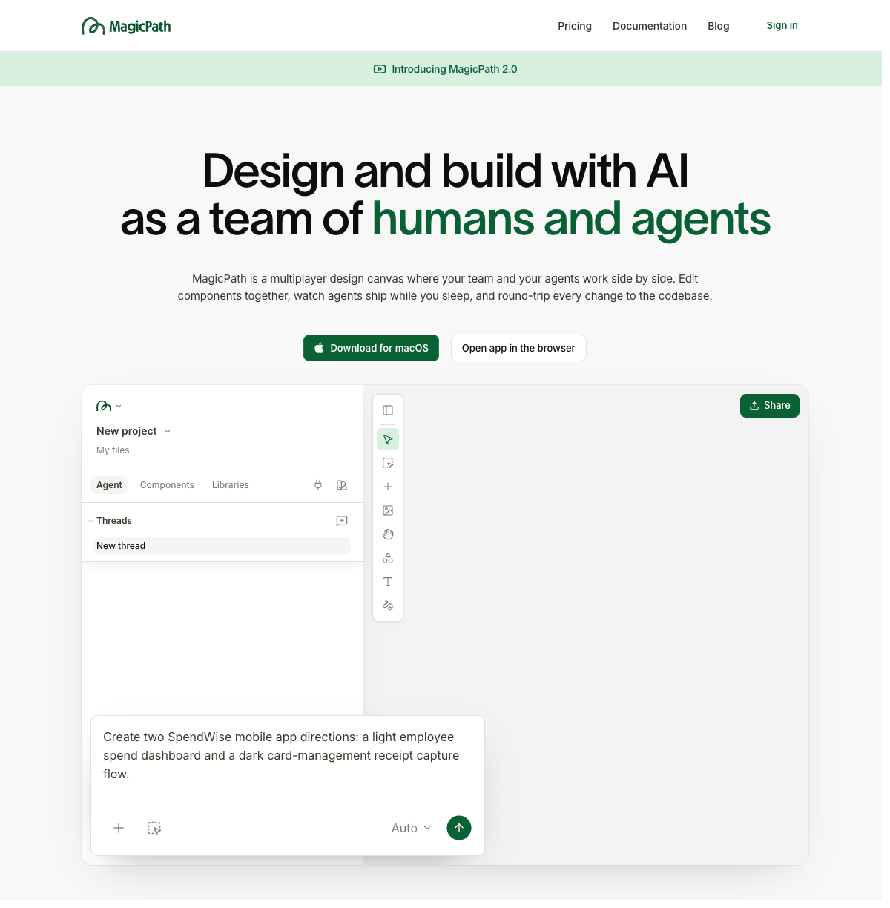
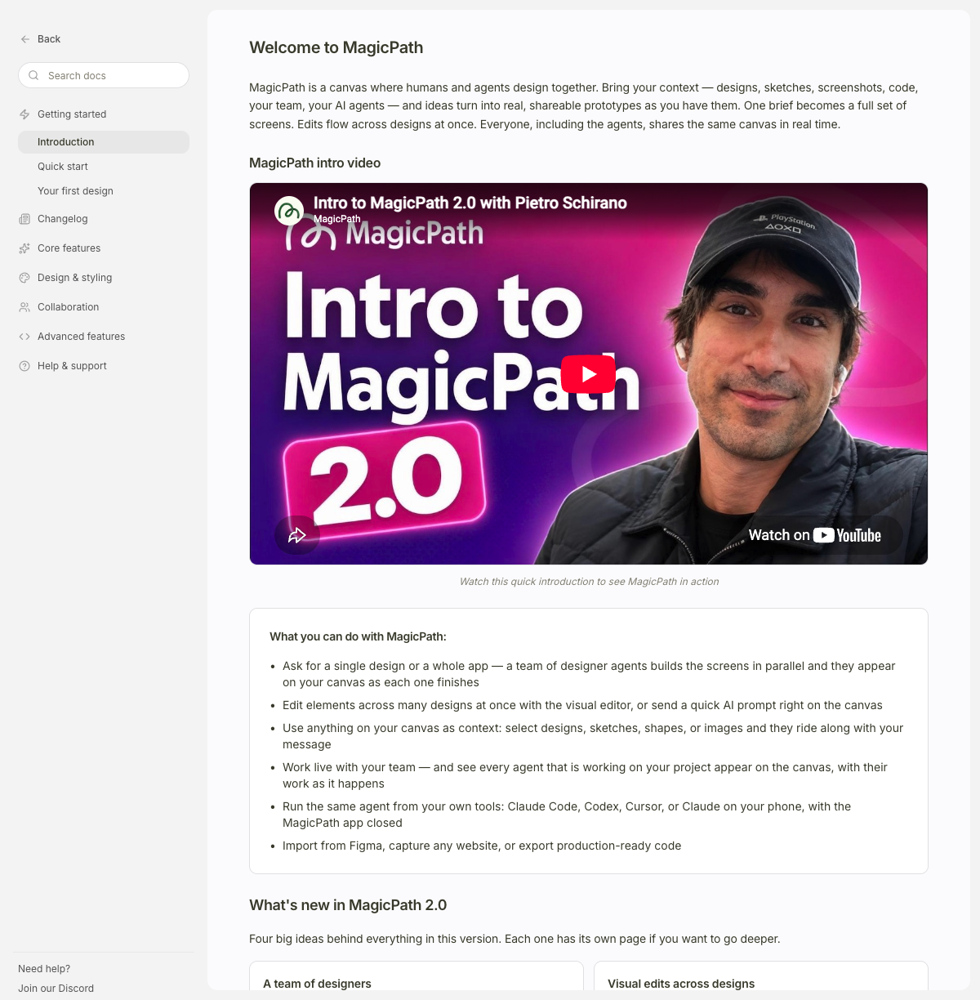

_(capture failed: the vercel-blob "infinite canvas" screenshot URL is dead — server returns "Blob not found")_

- **Steal these patterns:**
  - **Prompt-to-canvas, not prompt-to-chat** — generated screens land as tiles on the infinite canvas where you keep working; the canvas *is* the document, chat is just an input. The strongest existing proof of appbox's core layout.
  - **Multi-page flow generation** — one prompt can produce a connected sequence of screens (multi-page flows), pre-arranged as a journey.
  - **Direct visual edit without re-prompting** — select an element on a generated screen and edit properties by hand; AI is for generation, hands are for refinement.
  - **Design-system import as generation constraint** — bring your own tokens/components so every generated screen is on-brand; maps to appbox's primitives/theme layer.
- **Why appbox:** MagicPath is the freshest evidence that "design tool = infinite canvas + AI" beats chat-only tools for designers. Its weakness (credit burn, freezes, no built-app truth) is appbox's opportunity.
- **Freshness:** 🔥 (launched 2025, 2.0 mid-2025, active debate through 2026)

## 7. Onlook — "Cursor for designers", visual editing of real code

- **URL:** https://onlook.com/ · [Y Combinator W25](https://www.ycombinator.com/companies/onlook) · 2026 review: [superdesign.dev](https://superdesign.dev/blog/cursor-for-design)

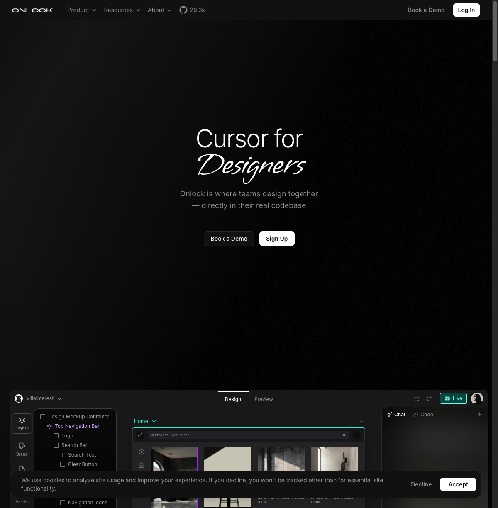

- **Steal these patterns:**
  - **Point-and-click on the live app writes back to source** — select a rendered element, change it visually, and the actual code files update. appbox's builder edits extension-point Views the same way: the canvas manipulates the real target, never a copy.
  - **Layers/style panel on a running app** — Figma-style inspector (layout, typography, colors) bound to live components.
  - **Open-source credibility signals** — GitHub stars, HN traction; indie-dev evaluators reward this. appbox's local-daemon architecture has the same "my machine, my code" honesty.
- **Why appbox:** Onlook proves the evaluator persona (technical, design-taste, anti-lock-in) responds to "visual editor over real code." appbox is that, for Flutter, plus pipeline gates.
- **Freshness:** 🔥 (YC W25, #1 trending GitHub repo, still climbing in 2026)

## 8. tldraw — infinite-canvas SDK as a product surface

- **URL:** https://tldraw.dev/ · SDK: [npm tldraw](https://www.npmjs.com/package/tldraw) · $10M Series A / ClickUp & Padlet licensing: [CB Insights](https://www.cbinsights.com/company/tldraw)

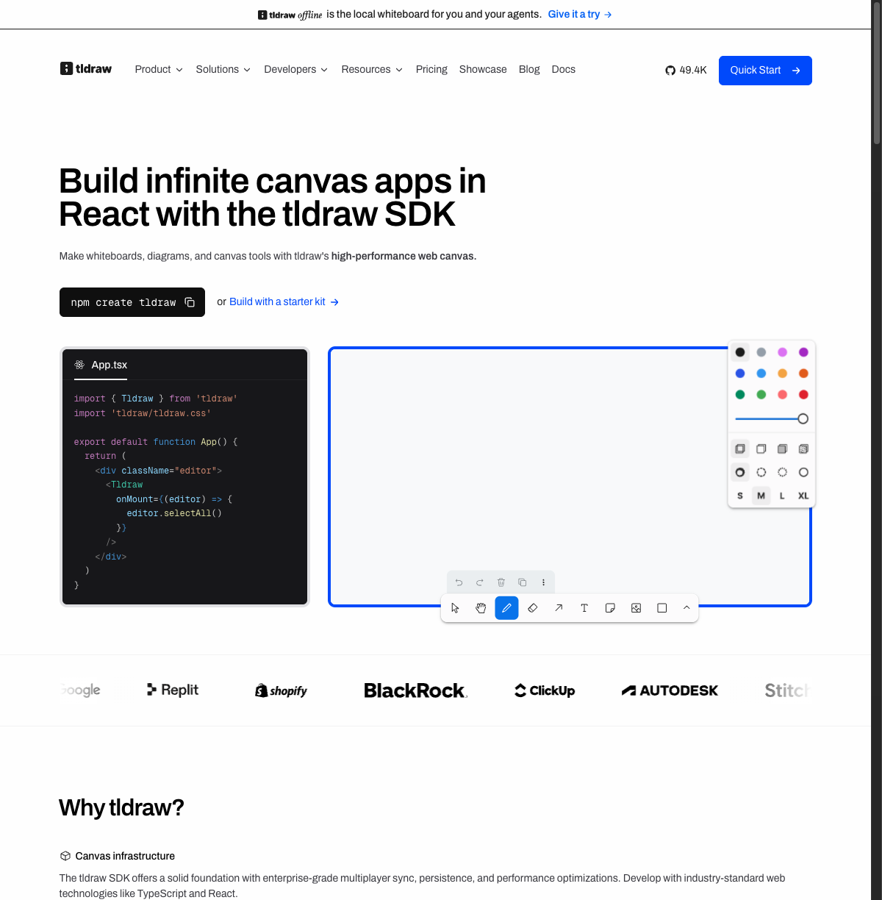

- **Steal these patterns:**
  - **Canvas ergonomics benchmark** — pan/zoom feel, box-select, snap, arrow-binding between shapes; thousands of objects at 60fps. Whatever tech appbox's canvas uses, this is the interaction-quality bar users will compare against.
  - **Everything-on-canvas is a live component** — shapes can embed interactive media, iframes, bookmarks. For appbox: a screen tile shouldn't be a dead PNG — it can be an interactive embed of the running screen.
  - **Hand-drawn aesthetic as a feature** — sketchiness signals "draft, discussable"; a toggle between sketch-style and pixel-perfect capture styles would serve both the founder (review) and the evaluator (polish).
- **Why appbox:** If the flows canvas is Flutter-web, tldraw (React) isn't the implementation — it's the *feel* reference. Its SDK success also validates canvas-as-core-UI as a business, not a gimmick.
- **Freshness:** 🔥 (Series A Apr 2025, actively shipped SDK)

## 9. Mobbin — the screen-collection browsing reference

- **URL:** https://mobbin.com/ · 2025 reviews: [abdulazizahwan.com](https://www.abdulazizahwan.com/2025/08/mobbin-review-2025-is-it-worth-the-subscription-features-pricing-pros-and-cons.html), [easyweb-agency.fr](https://www.easyweb-agency.fr/en/outils-comparatifs/mobbin)

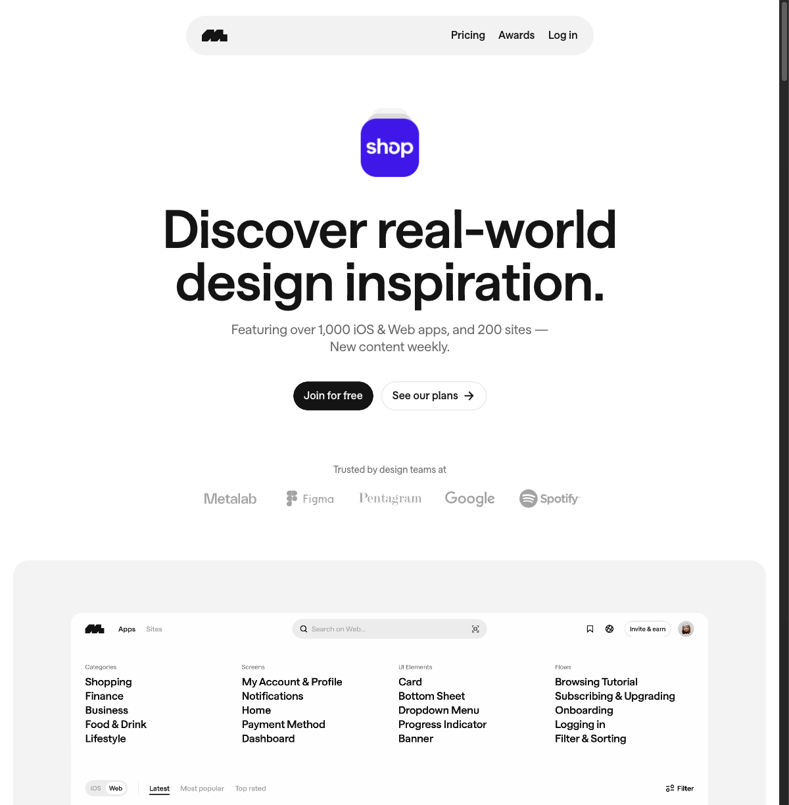

_(capture failed: the dense flows browsing grid requires a Mobbin login)_

- **Steal these patterns:**
  - **Complete user flows as first-class objects** — not loose screenshots: ordered sequences ("Spotify onboarding, 14 screens") you scrub through. appbox flows should be named, ordered, replayable journeys, not just spatial clusters.
  - **Dense grid of uniform screen cards** — same-size device-framed thumbnails with app/flow metadata; scanning 100 screens feels effortless. Card chrome: app name, flow name, screen index, platform badge.
  - **Filter/search over collections** — by pattern, platform, category. For appbox: filter canvas tiles by story-map epic/feature, by gate status, by surface (macos/ios/android).
  - **Personal collections** — save/pin subsets. For appbox: the founder pins the "v1 scope" flow set as an approval artifact.
- **Why appbox:** Mobbin is the best-in-class answer to "how do you render large screen collections so people actually browse them." Its flows view is the static-preview version of appbox's live captured flows.
- **Freshness:** 🌡️ (mature, constantly updated library; UI conventions stable)

## 10. Storybook — per-state variant switching on a surface card

- **URL:** https://storybook.js.org/

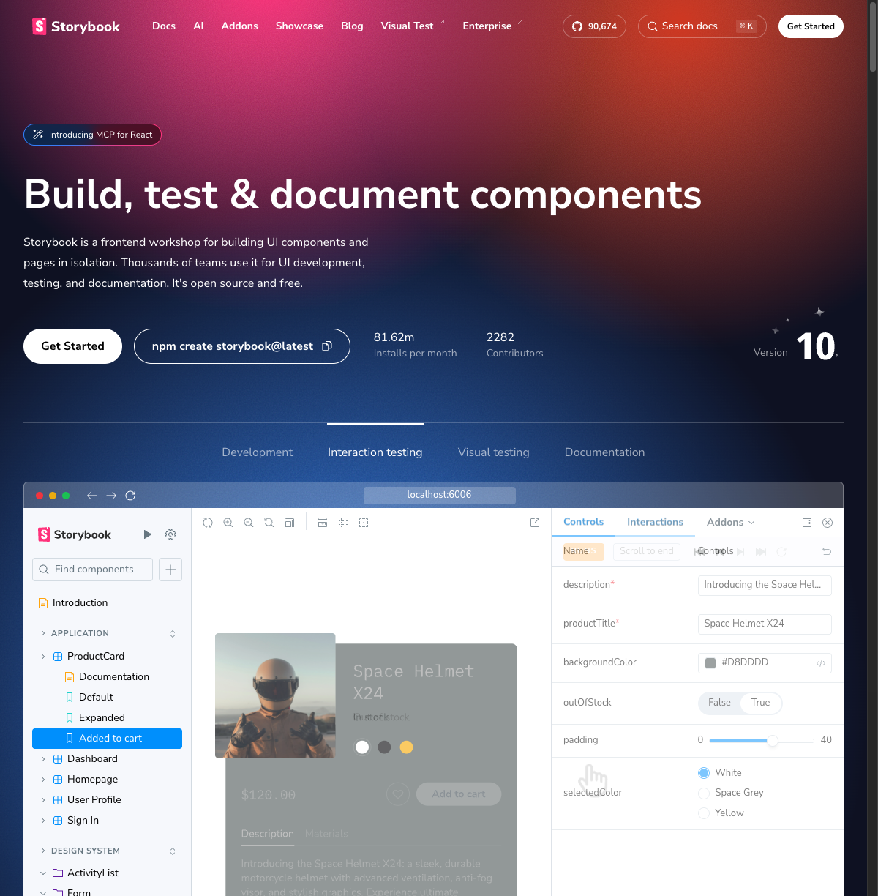

- **Steal these patterns:**
  - **Per-state variant switcher on a surface card** — one component, a dropdown/toolbar of named states ("default / loading / empty / error / dark"). A flows-canvas tile with a state switcher turns a static screenshot into a *surface dossier*.
  - **Controls panel** — typed knobs (booleans, enums, text) that re-render the component live. For appbox: tweak ViewModel inputs on a tile and watch the rendered design update — demonstrating states without navigating the app.
  - **Docs page = component + states + usage notes** — the tile's detail view: large render, state matrix, links to source file and story-map story. This is the evaluator's trust-builder.
- **Why appbox:** appbox emits surfaces with ViewModels; Storybook is the proven pattern for "show every state of a thing without clicking through the app." The flows canvas handles *between-screen* navigation; Storybook patterns handle *within-screen* states. Together they cover the whole app.
- **Freshness:** 🌡️ (venerable but still the industry default; the pattern, not the tool, is what to steal)

---

## Patterns appbox must have — top 10

1. **Screen tiles are living captures, not PNGs** — every tile on the flows canvas renders (or hot-reloads from) the actual built target or emitted design; staleness is shown as a badge, never silently. (Dreamflow, Onlook)
2. **Figma-style connector noodles between screens** — drag from a hotspot on one tile to another tile; labeled bezier arrows ("on tap →"), visible at all zooms, re-routing as tiles move. (Figma, Overflow)
3. **Truth-derived flow connections** — auto-infer arrows from real navigation in the built app (route table, deep links), with manual annotation on top; never make the founder draw what the app already knows. (Overflow's AI suggestions, done right)
4. **Named, ordered, replayable flows** — flows ("Onboarding", "Checkout") are first-class objects: scrub/play them as a walkthrough for gate reviews, not just admire the spatial map. (Mobbin, Overflow playable mode)
5. **Zoom-semantic canvas with minimap + sections** — crisp thumbnails at flock zoom, full fidelity close-up; story-map epics/features render as canvas sections so the map *is* the information architecture. (Figma, tldraw)
6. **Per-tile state variant switcher** — a toolbar on each tile flipping default/loading/empty/error/dark-form-factor, so a screen's states are reviewable in place. (Storybook)
7. **Prompt-to-canvas generation** — AI output lands as tiles on the same canvas the human works on; chat is an input method, never the main surface. (MagicPath, Figma Make)
8. **Click-to-edit on live previews** — select an element in a running preview and change it visually or by prompt; writes back to the real extension-point View/ViewModel. (Lovable, Onlook)
9. **Versioned checkpoints per generation** — every AI pass is a rollback-able checkpoint; gate approvals/rejections attach to checkpoints so the audit trail is visual. (v0)
10. **Uniform, dense screen-card grid with filters** — device-framed uniform tiles with metadata chrome (surface badge, gate status, story link), filterable by epic/status/platform; the evaluator must be able to scan 100 screens without fatigue. (Mobbin)
