# Moodboard — Builder UI & Pipeline/CI Dashboards

Slice: pipeline/CI dashboards + premium developer-tool UIs, curated for **app-box** (daemon + Flutter web builder UI + macOS shell; 3 human gates — design / build / ship; per-surface traceability; SARIF findings with file:line; iOS+Android companion with push-on-red-gate approvals).

Curated 2026-07-28 via live web research. Freshness legend: **🔥** = current 2025–2026 craft bar · **🌡️** = mature/canonical, steal selectively · **❄️** = dated or dead, study for one idea or as a warning.

---

## 1. Linear — https://linear.app · 🔥

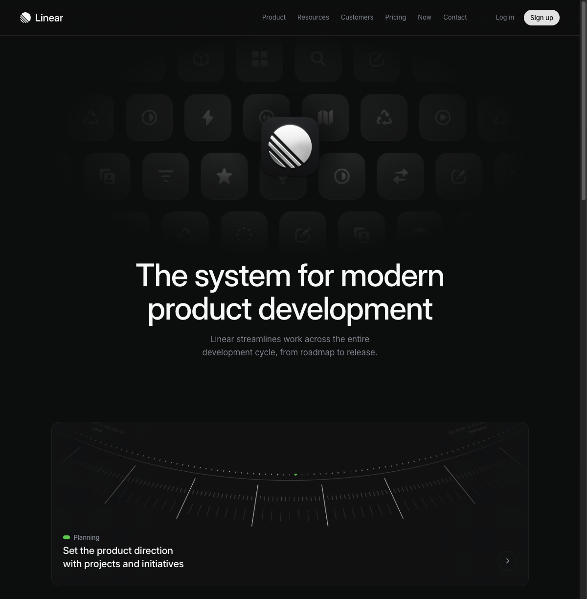
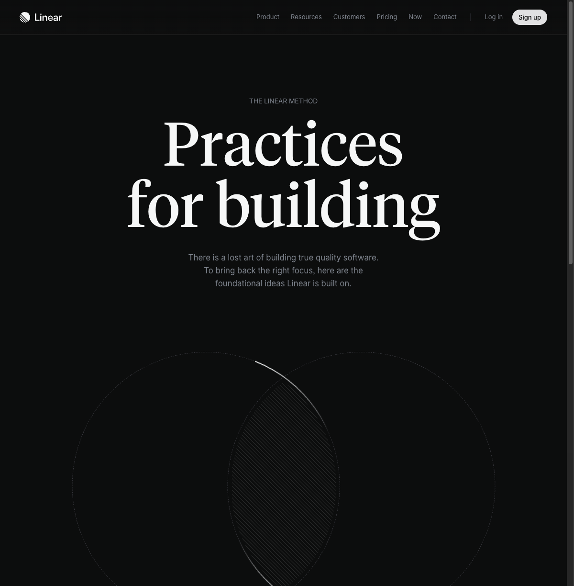

Still the reference point every "Linear-tier polish" comparison is measured against. Keyboard-first, sub-100ms interactions, zero visual noise.

- **Steal for app-box:**
  - **Triage Inbox as the gate queue.** Linear's Triage is a holding lane where new issues land *before* entering a cycle, with explicit Accept / Decline / Snooze actions. Map directly: the design/build/ship gate queue is a triage inbox — pending approvals never pollute the main pipeline view until accepted.
  - **Command palette (`Cmd+K`) that is action-first, not search-first.** Every entity (issue, project, cycle) exposes contextual actions; the palette is the primary navigation surface, not an afterthought.
  - **Sub-issue trees with rolled-up status.** A parent issue shows child progress inline. This *is* per-surface traceability: a client app = parent, surfaces = children, each surface carrying its own gate/check status rolled up.
  - **Detail-page side panel of pure metadata** (status, assignee, labels, relations) — dense, monospace-adjacent, every value copyable. Model the run/manifest detail panel on it (manifest hash, structure.json commit, daemon version).
  - **Cycles = time-boxed auto-rolling lanes.** Incomplete items roll forward visibly. Applies to app-box pipeline retries: a re-run inherits and shows what carried over.
- **Why it fits:** app-box's founder user wants *depth without clutter* — Linear proves a dense data tool can feel calm. Its status semantics (Backlog → Todo → In Progress → Done + blocked/triage states) map almost 1:1 onto gate states (queued → running → awaiting approval → approved/rejected).
- **Look at:** [Features](https://linear.app/features), [Linear Method](https://linear.app/method) (opinionated workflow philosophy worth echoing in app-box's gate copy), [Changelog](https://linear.app/changelog) (also a template for honest, specific release notes).

## 2. Vercel Dashboard + Deploy Previews — https://vercel.com · 🔥

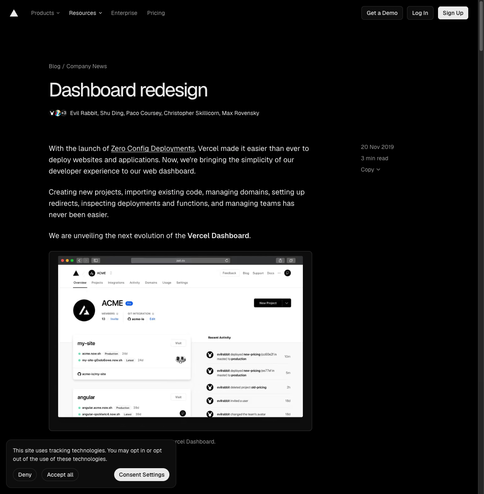
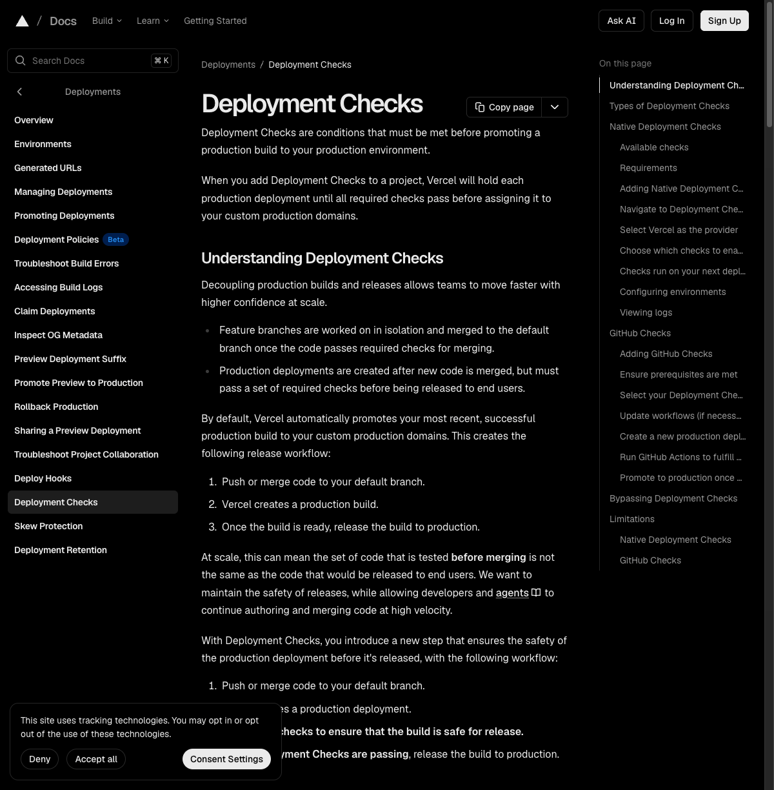

The canonical "pipeline run as a first-class page" design, plus the best quality-gate-as-UI pattern in the industry.

- **Steal for app-box:**
  - **Deployment Details page = Run Details page.** Header with status pill + commit/ID + duration; a **"Building" accordion that streams expandable per-step logs**; sections below for domains/artifacts. This is the exact skeleton for an app-box pipeline run page (intake → structure → scaffold → build → review → gates).
  - **Deployment Checks = app-box's gates.** Checks are named, blocking conditions rendered as a checklist with running/succeeded/failed states that must pass before promotion — literally a build/ship gate. Steal the check row: name, status icon, duration, expandable output, "re-run" affordance.
  - **Preview-deployment tile with commit, URL, and screenshot thumbnail** on the project overview. For app-box: each emitted build gets a card with surface thumbnails + QR/link to the running preview — the indie dev's "fast first win".
  - **PR-comment bot pattern** (bot posts preview link + status on the PR) → the companion app's push notification + gate summary card.
  - **Geist design system** — Vercel's published tokens/components; a concrete reference for monochrome-with-one-accent restraint.
- **Why it fits:** Vercel made "watch a build run" feel pleasant — status is glanceable from the list, depth is one click away, and failures surface the *relevant* log line first. That's the honesty the evaluator persona wants, and checks-as-UI is the founder's gate model verbatim.
- **Look at:** [Dashboard redesign post (annotated screenshots)](https://vercel.com/blog/dashboard-redesign), [Deployment Checks docs](https://vercel.com/docs/deployment-checks), [Build logs docs](https://vercel.com/docs/deployments/logs), [Runtime logs (search/inspect/share)](https://vercel.com/docs/logs/runtime), [Geist](https://vercel.com/geist).

## 3. GitHub Actions UI + GitHub Mobile — https://github.com/features/actions · 🔥

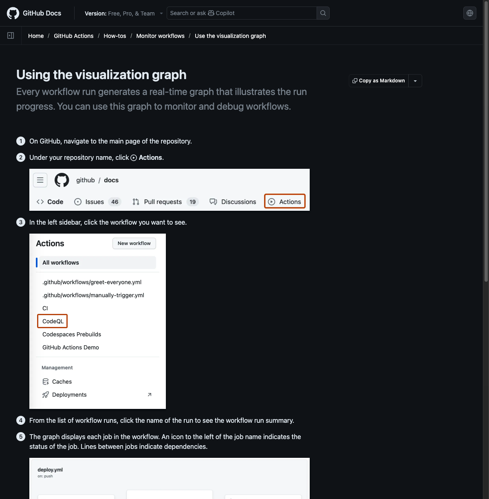
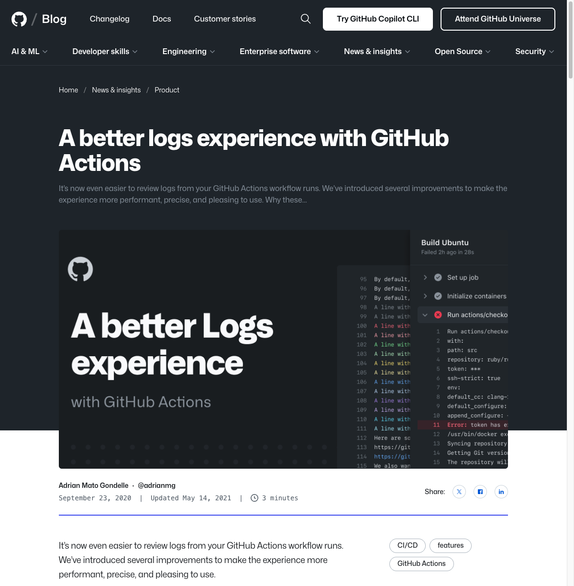

The pattern every developer already knows — app-box wins by being familiar here, not novel.

- **Steal for app-box:**
  - **Workflow run visualization graph:** a live DAG of jobs with per-node status icons (queued spinner / running / green check / red x / grey skipped), click a node → its steps. This is the app-box pipeline graph (stages as nodes, gates as blocking nodes with a distinct "hand/pause" glyph).
  - **Per-step expandable logs with timestamps and duration chips**, auto-scrolling while running, and the failed step auto-expanded on open. Non-negotiable for run debugging.
  - **Left sidebar = runs list with status dots + filter chips** (status, branch, actor). Cheap, learned-by-everyone navigation for the run history.
  - **Annotations on the run summary** (lint/test warnings surfaced above the fold, not buried in logs) → surface SARIF finding *counts by severity* at the top of each run.
  - **"Re-run failed jobs only"** → "re-run from failed stage" in the daemon pipeline.
  - **GitHub Mobile precedent for push-on-red-gate:** GitHub Mobile pushes review requests and — crucially — lets you **approve a protected-environment deployment from a push notification** on your phone. That is app-box's red-gate push approval, already validated at scale.
- **Why it fits:** zero learning curve for the evaluator persona; the DAG + expandable-steps vocabulary is industry-standard, so app-box's innovation budget should go to gates and traceability instead of reinventing run pages.
- **Look at:** [Visualization graph docs (screenshots)](https://docs.github.com/actions/managing-workflow-runs/using-the-visualization-graph), [Workflow run logs docs](https://docs.github.com/en/actions/how-tos/monitoring-and-troubleshooting-workflows/monitoring-workflows/using-workflow-run-logs), [A better logs experience (GitHub blog)](https://github.blog/news-insights/product-news/a-better-logs-experience-with-github-actions/), [Mobile push approvals changelog](https://github.blog/changelog/2021-11-22-push-notifications-for-pull-request-review-activities-on-github-mobile/), [Mobile deployment-review discussion](https://github.com/orgs/community/discussions/110751).

## 4. Buildkite — https://buildkite.com · 🌡️

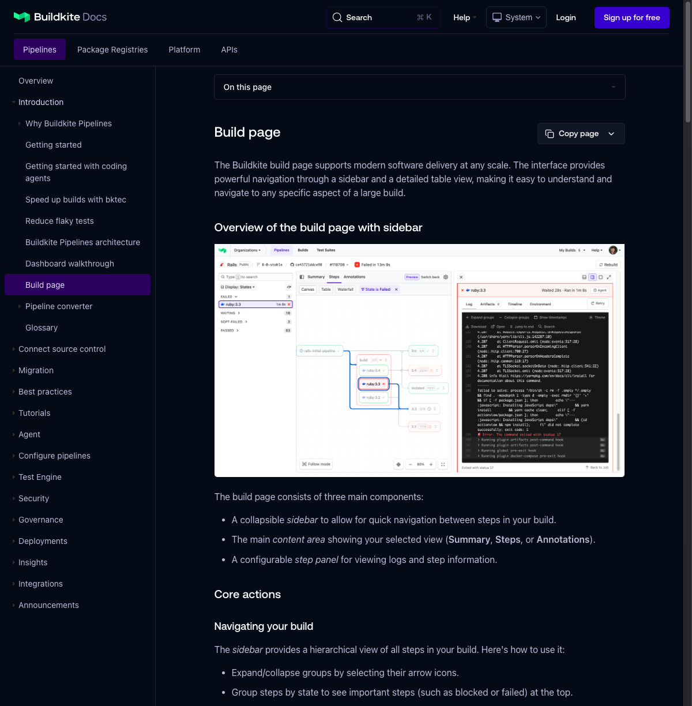
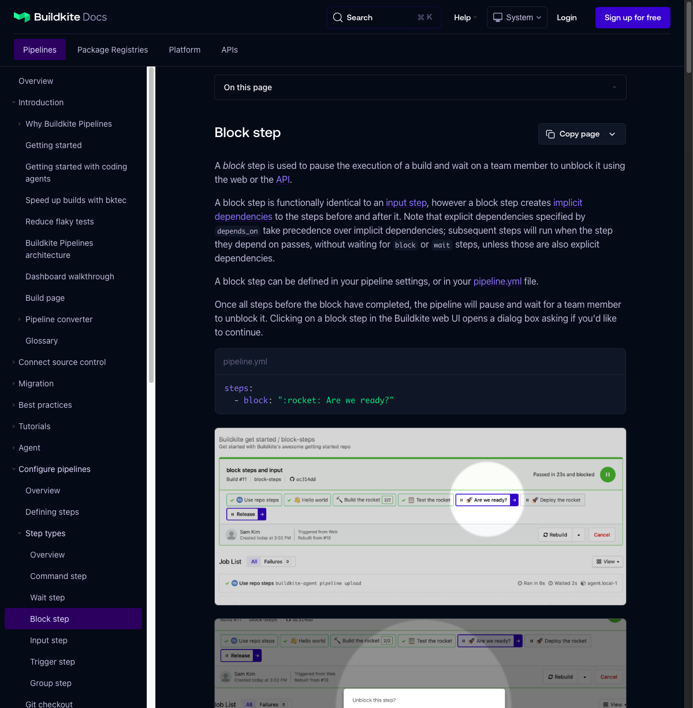

The connoisseur's CI UI: less hype than GitHub/Vercel, but it ships two patterns app-box should take wholesale.

- **Steal for app-box:**
  - **Block steps — a literal human-approval step type.** A pipeline pauses on a "block" node that renders a custom form (text fields, selects) and an Unblock button; the pipeline waits for a human. This is app-box's design/build/ship gate *exactly* — including the idea that a gate can collect structured input at approval time ("rename surface X", "bump version") rather than just yes/no.
  - **Build annotations:** pipeline steps can attach rich markdown/HTML content (reports, screenshots, even GIFs) to the build page. app-box equivalent: gate summaries, structure diffs, coverage reports, and preview screenshots pinned to the run page by the pipeline itself.
  - **Waterfall view:** a Gantt of all jobs in a build — duration bars, parallelism visible, bottlenecks obvious, click a bar to jump to the job. Perfect for showing where daemon time goes (LLM stage vs scaffold vs compile).
  - **Summary / Steps / Waterfall tab triad** on the build page — a clean information hierarchy for run detail.
- **Why it fits:** Buildkite treats "human in the loop" as a first-class pipeline primitive, not an afterthought — same thesis as app-box's gates. The waterfall also serves the founder's depth appetite: honest timing data, no vanity metrics.
- **Look at:** [Build page anatomy (annotated screenshots)](https://buildkite.com/docs/pipelines/build-page), [Annotations docs](https://buildkite.com/docs/pipelines/configure/annotations), [Block step docs](https://buildkite.com/docs/pipelines/configure/step-types/block-step), [Waterfall view improvements](https://buildkite.com/resources/releases/2024-q1/investigate-jobs-from-the-waterfall-view/).

## 5. Expo EAS Dashboard — https://expo.dev/eas · 🌡️

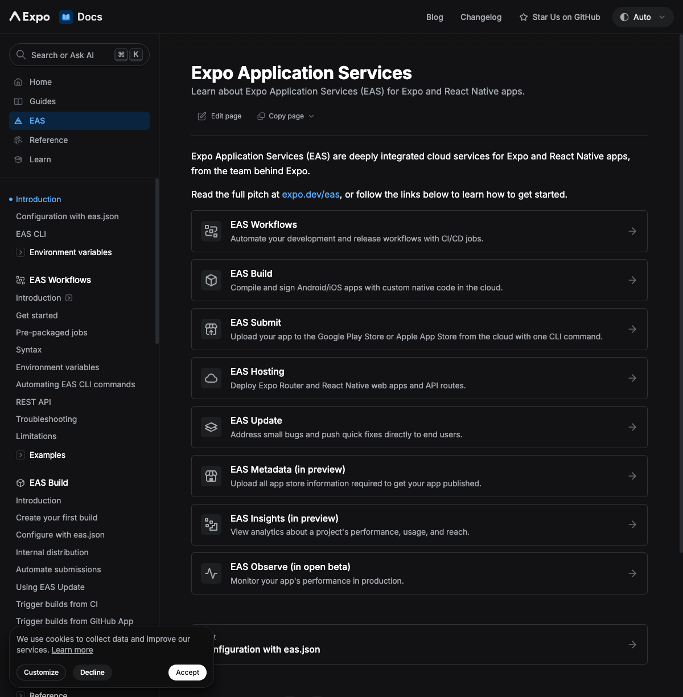
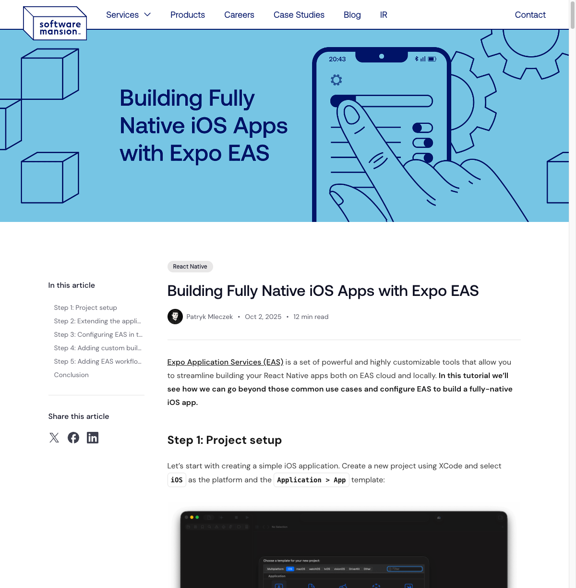

The most relevant *Flutter-adjacent* reference: cloud builds for mobile apps, per-platform artifacts, store submission — app-box's ship stage in miniature.

- **Steal for app-box:**
  - **Build rows keyed by platform:** each build row carries an iOS/Android chip, version + build number, profile, status color, and artifact action (download/install QR). app-box's emitted-app builds list should copy this row verbatim — it's what mobile devs expect.
  - **Build detail = ordered step list with per-step logs** (install deps → prebuild → doctor → compile), where the failing step is pre-expanded and the *exact* failing command is shown. Reinforces app-box's copy-reproduce-command affordance on findings.
  - **Credentials/signing status surfaced as checklist items**, not hidden config — trust-building for the ship gate.
  - **Update/channel model** (which build is live where) → app-box's "which approved build is deployed per client" ledger view.
- **Why it fits:** EAS proves the per-surface/per-platform matrix UI app-box needs (surfaces × platforms × gate states), and its onboarding (eas init → first cloud build in minutes) is the "fast first win" flow the indie evaluator judges app-box by.
- **Look at:** [EAS docs hub](https://docs.expo.dev/eas/), [Custom builds changelog](https://expo.dev/changelog/2023-08-10-custom-builds), [Building native iOS apps with EAS (walkthrough with dashboard screenshots)](https://swmansion.com/blog/building-fully-native-ios-apps-with-expo-eas-760b5480d7c5/).

## 6. Trigger.dev — https://trigger.dev · 🔥

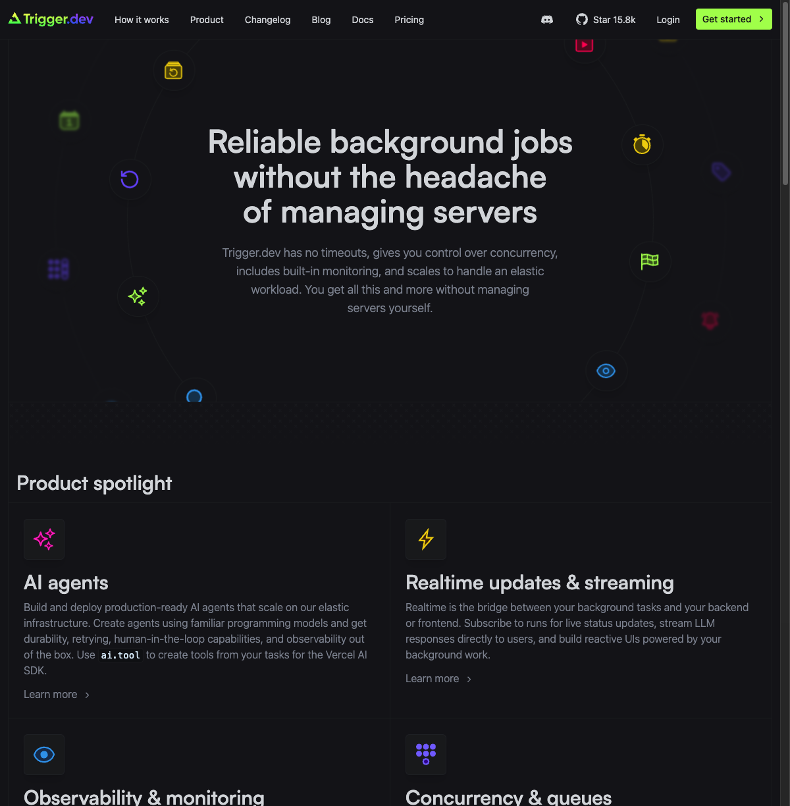
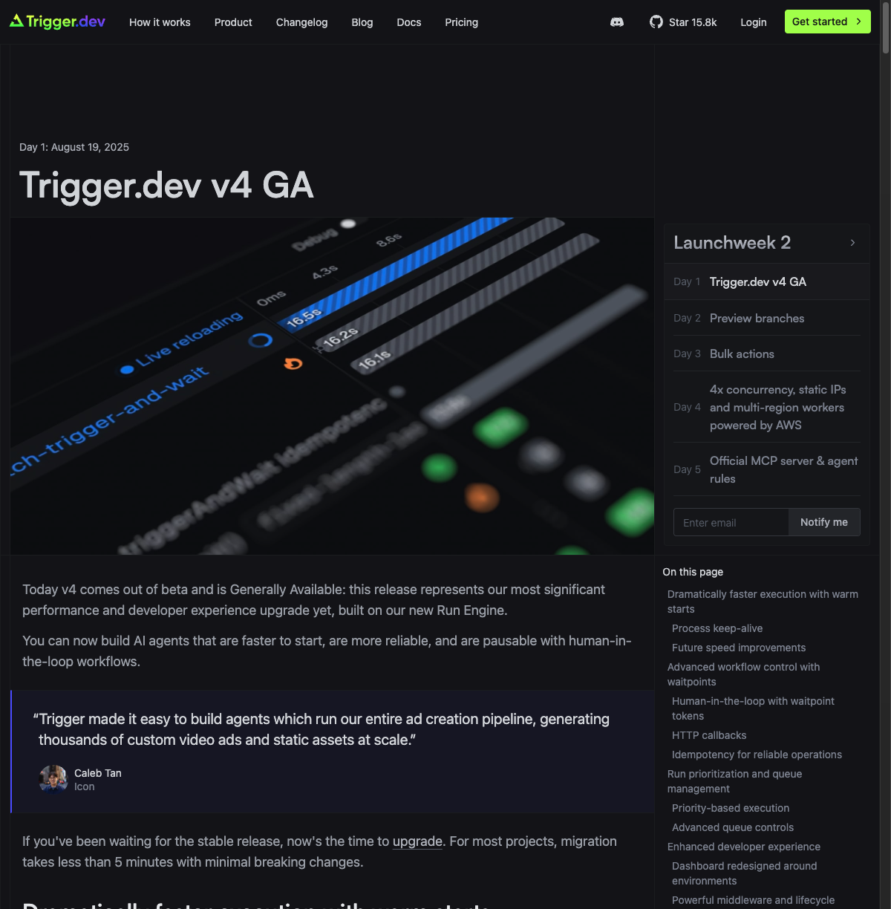

The freshest (2025–2026) take on run observability for long-running, AI-flavored job pipelines — the closest analog to app-box's daemon runs.

- **Steal for app-box:**
  - **Live run page with a real-time trace view** (OpenTelemetry spans): a waterfall of spans updating while the run executes, click any span for its logs/attributes. app-box's AI pipeline stages (design emit, scaffold, build, review) are spans — give each stage inputs/outputs visible in a trace, not just a log blob.
  - **Environments as first-class navigation** (dev / staging / prod switcher that re-scopes the whole dashboard, v4 redesign) → app-box's client/project scoping.
  - **Run list with replay + filter by status/version**, and **test-run affordances** ("replay this run with same input") → re-run a client brief through the pipeline deterministically.
  - **Dashboards you compose from run data** (charts over your own runs, 2026) → app-box ledger analytics: gate pass rates, findings per run over time.
- **Why it fits:** Trigger.dev's v4 (Aug 2025) shows the current state of the art for "make an async, minutes-long pipeline legible live" — exactly the daemon-run problem, and it reads as modern rather than enterprise-CI beige.
- **Look at:** [Product page (live run trace screenshots)](https://trigger.dev/product), [v4 GA redesign notes](https://trigger.dev/launchweek/0/trigger-v4-ga), [Query & Dashboards changelog](https://trigger.dev/changelog/query-and-dashboards).

## 7. Sentry — https://sentry.io · 🌡️

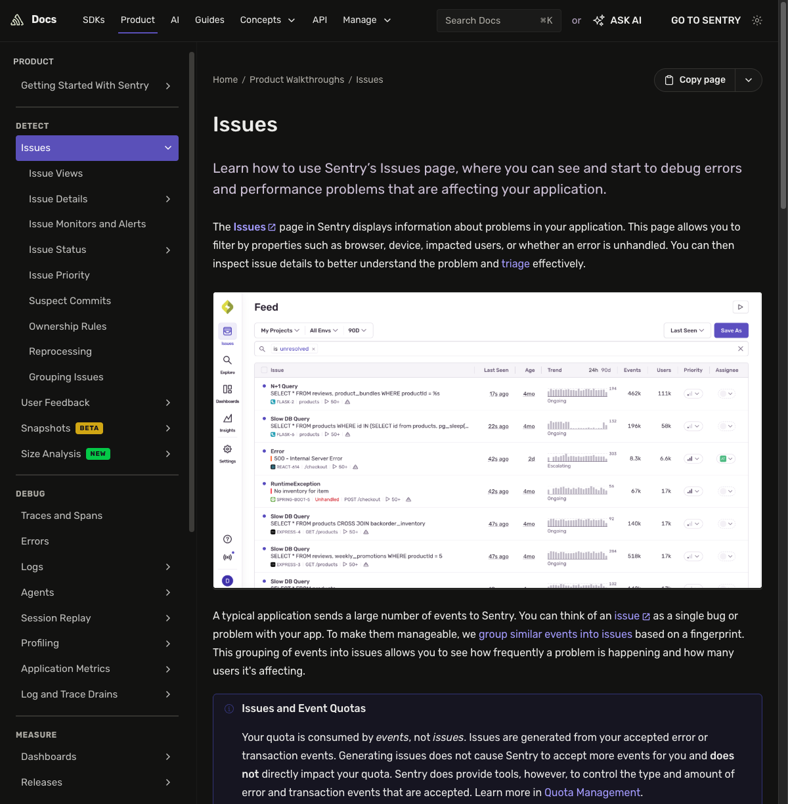
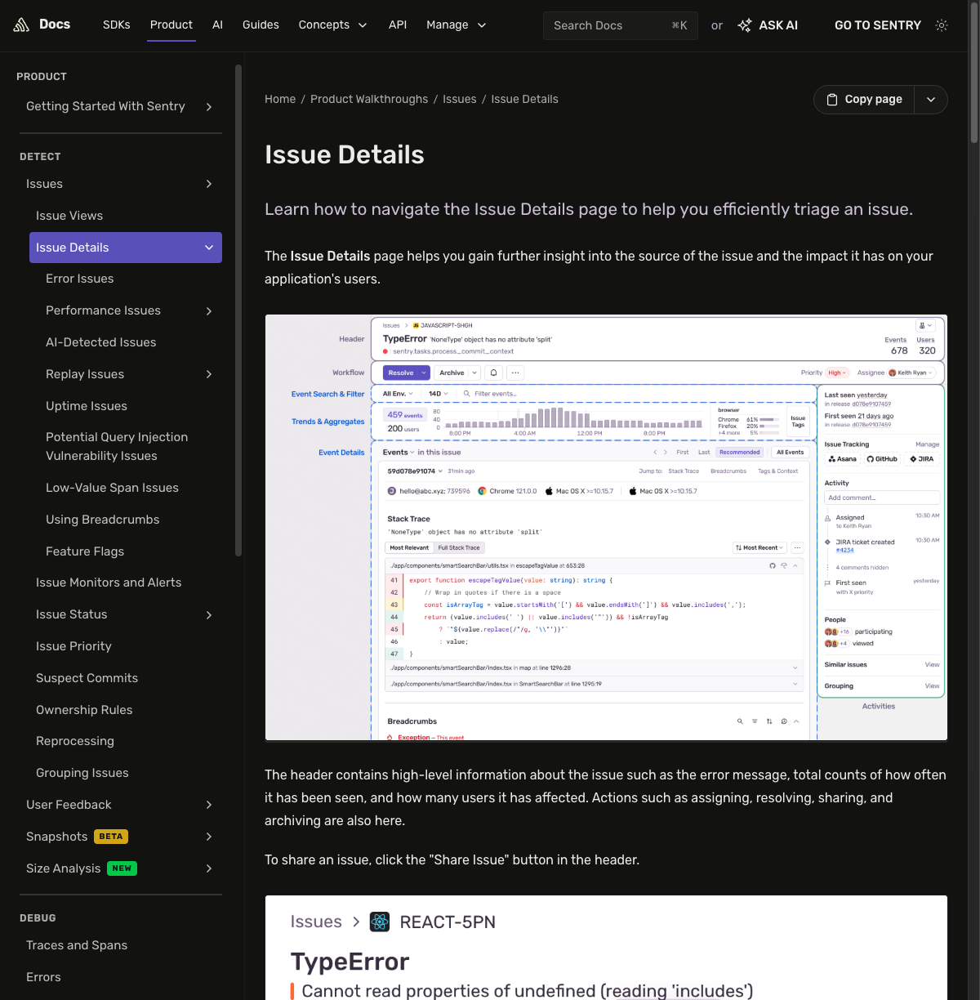

The canonical "findings stream" UX: dense, severity-driven, every row drillable to a stack frame with file:line.

- **Steal for app-box:**
  - **Issue stream rows:** severity color bar, title, culprit (file:function), event count + sparkline, first/last seen, assignee. app-box's findings list should be this row with SARIF fields: severity chip, rule ID, `file:line` chip, occurrence count across runs.
  - **Issue detail = stack trace frames that expand to source context**, with "suspect commit" attribution. Map: a finding expands to the emitted file region + which pipeline stage/surface generated it (traceability).
  - **Breadcrumbs trail** (events leading to the error) → the ledger: what the pipeline did before this finding appeared.
  - **Resolve / Ignore / Archive triage actions with keyboard shortcuts** on every row → finding disposition (fix, suppress with reason, defer) as first-class actions.
- **Why it fits:** app-box's SARIF findings need Sentry's discipline — aggregated, deduplicated, ranked by severity — or the founder drowns in linter noise. Sentry is also proof that a *very* dense table can stay readable with restrained color use.
- **Look at:** [Issues product docs (screenshots of stream + detail)](https://docs.sentry.io/product/issues/), [Issue details page docs](https://docs.sentry.io/product/issues/issue-details/).

## 8. GitHub Code Scanning (SARIF) — https://docs.github.com/en/code-security/code-scanning · 🌡️

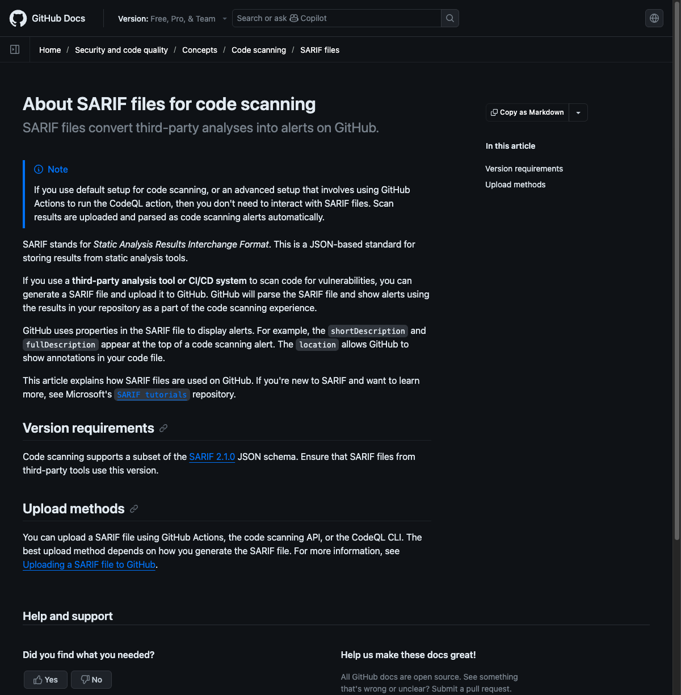
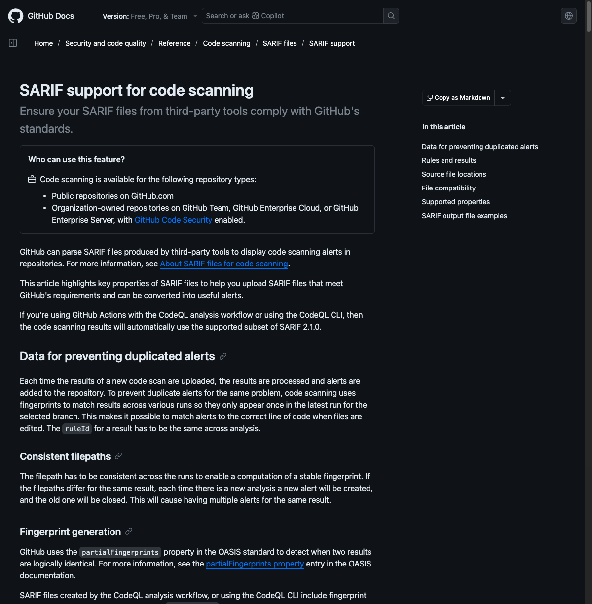

Not a product you admire — the literal specification of how SARIF results should render, since app-box speaks SARIF.

- **Steal for app-box:**
  - **Alert rows keyed by rule:** rule ID + short description, severity label, and a **`file:line` chip that deep-links into an annotated code view** (alert drawn inline on the offending lines).
  - **Alert detail shows `shortDescription`/`fullDescription` at top, location below** — mirror SARIF property → UI field mapping exactly; app-box renders its own SARIF the same way, zero translation cost.
  - **Dismissal with mandatory reason** (false positive / used in tests / won't fix) → app-box finding suppressions are auditable ledger entries, not silent deletions — the honesty requirement, encoded.
  - **Fingerprint-based dedupe** (`partialFingerprints`) so the same finding appears once across runs and tracks the right line as files change → app-box needs identical dedupe semantics across pipeline re-runs.
  - **"Copy alert link" + stable URLs per alert** → findings are shareable/paste-able into chat and gate discussions.
- **Why it fits:** this is the gravitational center of app-box's findings feature — matching GitHub's rendering conventions means developers already know how to read app-box findings, and SARIF stays a real interchange format, not decoration.
- **Look at:** [SARIF concepts (how properties map to the alert UI)](https://docs.github.com/en/code-security/concepts/code-scanning/sarif-files), [SARIF support reference (fingerprints, dedupe)](https://docs.github.com/en/code-security/reference/code-scanning/sarif-files/sarif-support).

## 9. Warp — https://www.warp.dev · 🔥

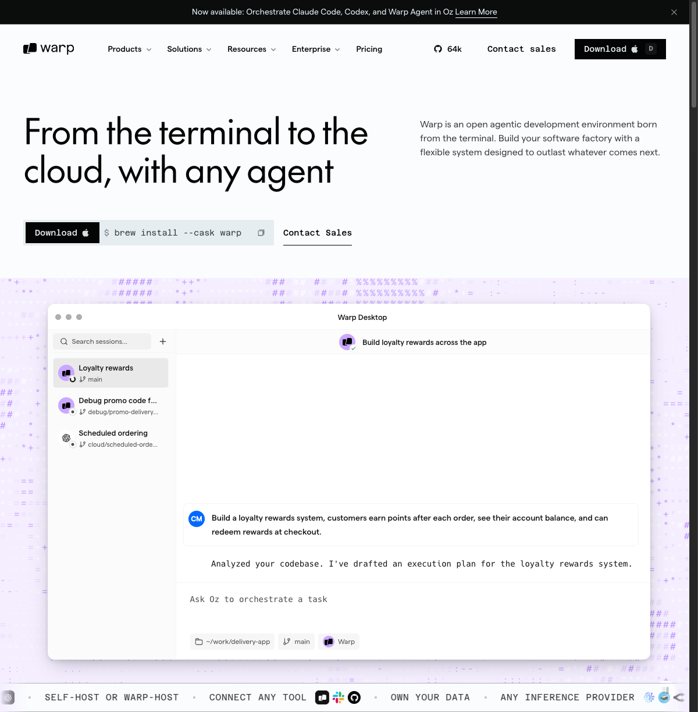
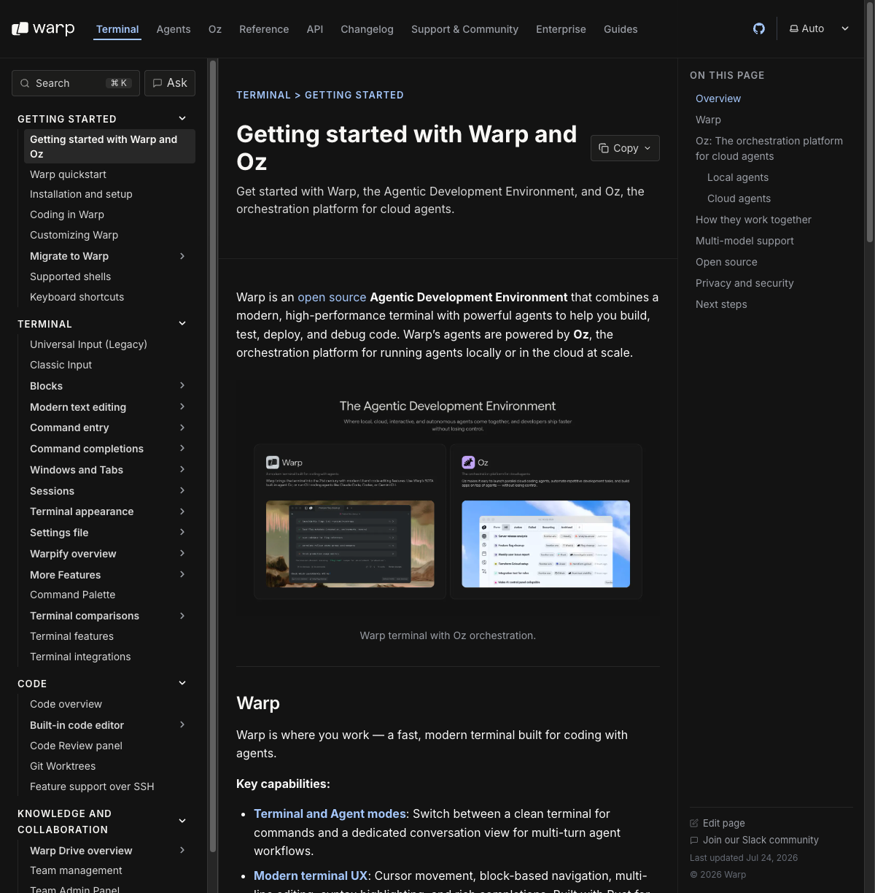

2025's most decorated dev-tool UI pivot (TIME Best Inventions 2025; repositioned as an "Agentic Development Environment") — and its core pattern predates the AI hype.

- **Steal for app-box:**
  - **Blocks: command + output grouped as one atomic, card-like unit** — collapsible, shareable by link, copyable, navigable via a block rail. app-box pipeline step output should be blocks, not an infinite scrollback: each stage emits a block you can expand, copy, link to, and attach to a gate discussion.
  - **AI command palette / natural-language prompt inline in the work surface**, not a separate chat window — the AI assists where the artifact lives.
  - **Session/run sharing by permalink** → share a pipeline run (or a red gate) with a link; pairs with the companion app's push deep-links.
  - **Honest progress affordances for agent work** ("prompt, steer agents, ship with confidence" — show what the agent did as inspectable units). app-box's AI stages must show diffs/outputs as reviewable blocks, not a "trust me" spinner.
- **Why it fits:** app-box is also an agentic pipeline whose credibility depends on making machine work inspectable; Warp's block model is the cleanest answer to "logs, but structured" since Buildkite annotations.
- **Look at:** [Warp Wrapped 2025 (product direction + accolades)](https://www.warp.dev/blog/2025-in-review), [Warp docs](https://docs.warp.dev), [The New Stack on blocks (concept explainer)](https://thenewstack.io/a-review-of-warp-another-rust-based-terminal/).

## 10. Zed — https://zed.dev · 🔥

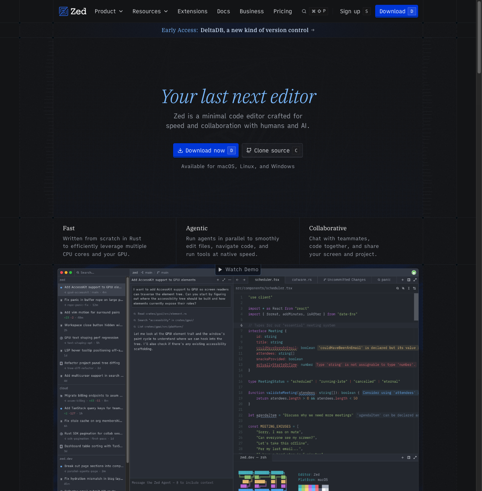
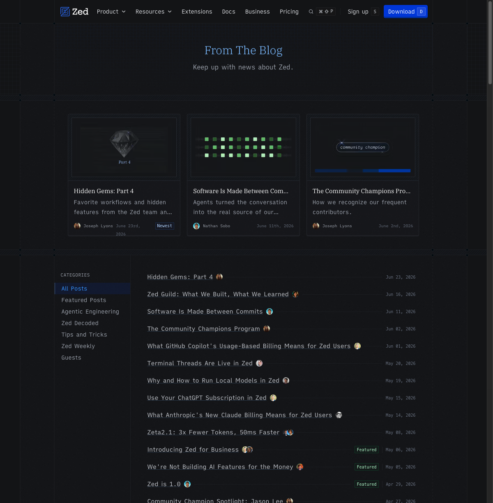

The bar for *native-shell* craft: GPU-rendered, minimal, fast — the target for app-box's macOS shell.

- **Steal for app-box:**
  - **Radical chrome minimalism:** one bar, near-zero ornament, content owns the window; panels appear on demand and get out of the way. The macOS shell should feel like this next to the Flutter web UI.
  - **Performance as a design feature** (GPUI; startup and render speed marketed as UX). For app-box: run lists and log views must scroll at 120fps with thousands of rows — jank reads as dishonesty to the evaluator.
  - **Diagnostics surfaced inline in context** (errors on the line, not in a separate tab) → findings rendered *on* the structure/surface they belong to, list view secondary.
  - **Collaboration primitives built in** (channels, shared projects) — lighter version: shared run links + presence on a gate ("founder is reviewing").
- **Why it fits:** Zed proves a dev tool can be both minimal and deep, and its "thoughtful, precise design" positioning is exactly the tone app-box's shell needs to hit Linear-tier.
- **Look at:** [zed.dev (positioning + visuals)](https://zed.dev/), [Zed blog (GPUI/perf engineering notes)](https://zed.dev/blog).

---

## Secondary references — steal one thing each

- **Raycast** — https://www.raycast.com · 🔥 — the **action panel**: every selected item (run, gate, finding, surface) gets `Cmd+K`-style contextual actions (copy reproduce-command, open in editor, share link, re-run). Also root-list metadata columns that update live. See [Raycast design tokens teardown](https://open-design.ai/plugins/design-system-raycast/).
  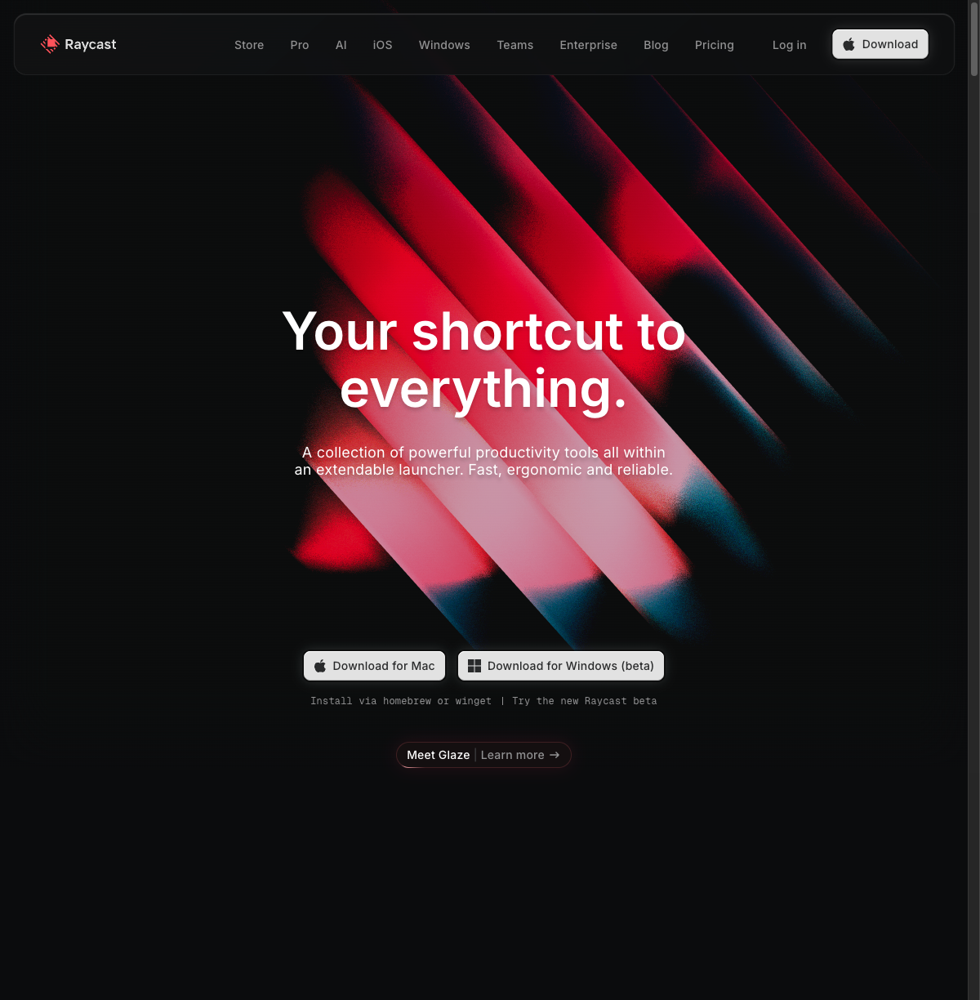
- **Graphite** — https://graphite.com · 🔥 — **stacked, ordered review queues**: PRs shown as an explicit dependency stack with per-node status and a merge queue that sequences them. app-box's ordered gate sequencing (design → build → ship, and surface-by-surface within a gate) is a stack — borrow the stack visualization and "merge when ancestors pass" semantics. (Reportedly acquired by Anysphere in Dec 2025; see [Graphite vs GitHub](https://codepulsehq.com/guides/graphite-vs-github), [stacked PRs explainer](https://graphite.com/blog/stacked-prs).)
  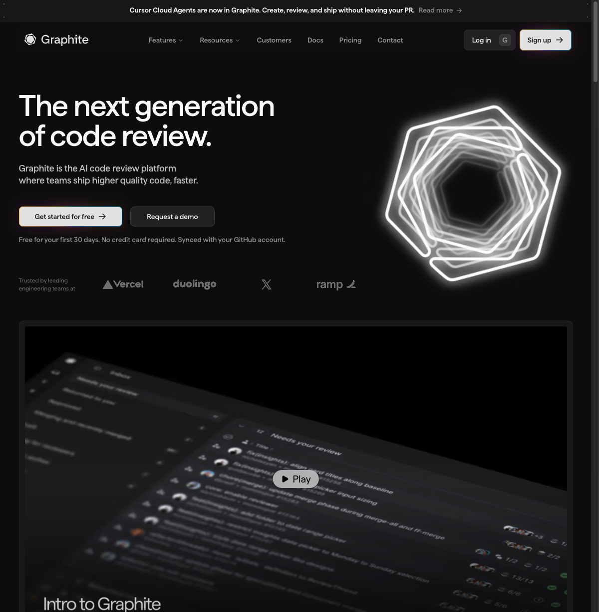
- **Height** — ~~https://height.app~~ ([shut down 2025-09-24](https://productgrowth.in/tools/product-management/height/)) · ❄️ — study its **AI-autonomy transparency**: the tool auto-maintained tasks and *showed its reasoning* for each automated change. That's the right honesty model for app-box's AI stages. Also the cautionary data point: best-in-class craft did not save the product — polish serves the pipeline story, never substitutes for it. ([Archived site](https://web.archive.org/web/2025/https://height.app/).)
  _(capture failed: web.archive.org unreachable from this network — CDP navigate timed out repeatedly, tab landed on chrome-error; retry when archive.org is reachable)_
- **Postman** — https://www.postman.com · ❄️ — **counter-pattern.** Once-crisp API client that accreted tabs, sidebars, and modal-on-modal flows until the community turned on it. app-box lesson: the builder UI must resist adding a surface for every feature — gates, runs, findings, ledger are four nouns; keep it at four nouns.
  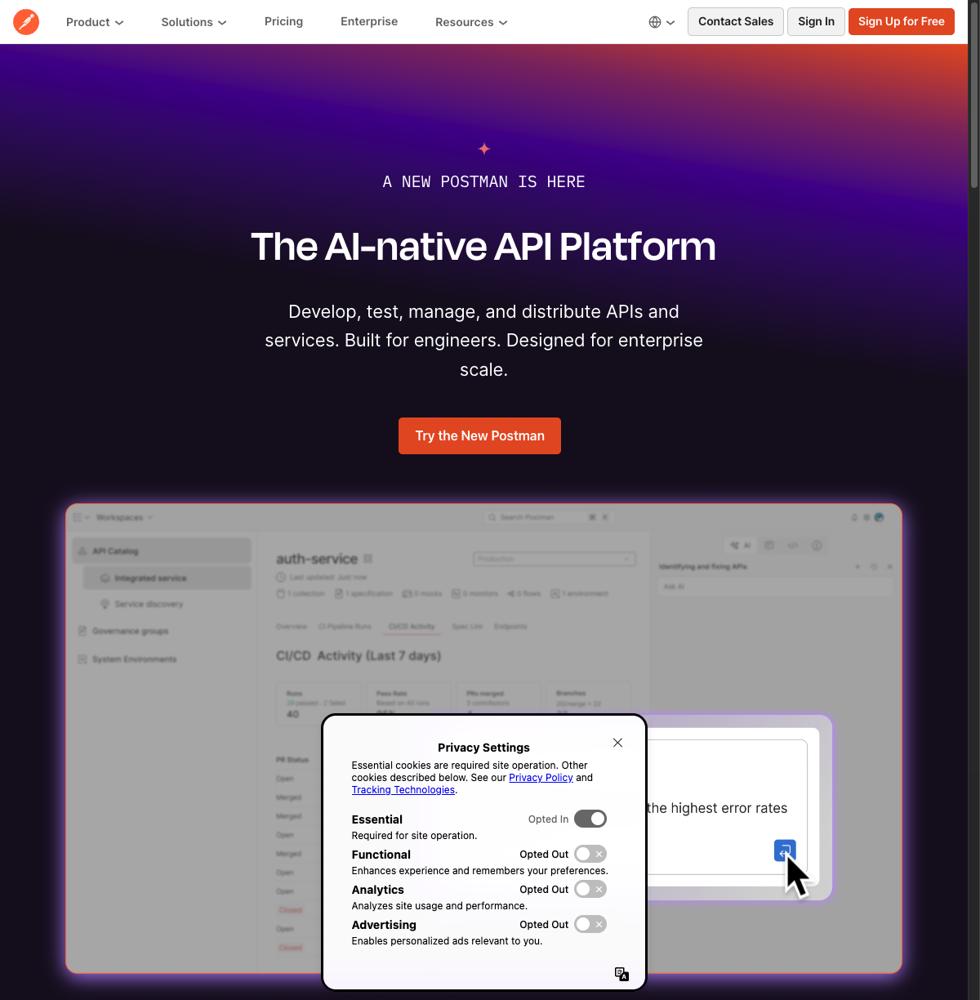

---

## Patterns app-box must have — top 10

1. **Run page = DAG + expandable step logs.** Live pipeline graph (GitHub Actions vocabulary) where every stage node expands into streaming, timestamped logs with duration chips; failed stage auto-expands with the failing command pre-highlighted.
2. **Gates as blocking checklists, not dialogs.** Vercel Deployment Checks / Buildkite block-step pattern: a gate is a named, persistent checklist on the run page (checks with status, evidence, approver, timestamp) — Approve / Request-changes / Reject with optional structured input, never a transient modal.
3. **Triage-style gate queue.** A Linear-triage inbox holding all pending approvals across clients, keyboard-triageable (accept, request changes, snooze), with red-gate items pinned and visibly blocking.
4. **Finding rows with file:line chips and dispositions.** Sentry/GitHub-code-scanning row: severity chip, rule ID, `path/file.dart:42` chip deep-linking to source context, occurrence count, and Resolve / Suppress-with-reason / Defer — every disposition written to the ledger.
5. **Copy-reproduce-command on everything.** Every finding and failed step exposes a one-click "copy command to reproduce locally" (daemon CLI), plus stable permalink. Vercel/GitHub convention; the single highest-trust affordance for the indie evaluator.
6. **Per-surface traceability matrix.** Rows = surfaces, columns = stages/gates (design, scaffold, build, review, ship), cells = status chips with timestamps; click any cell to the run/step that produced it. EAS platform rows + Linear sub-issue roll-ups, fused.
7. **Blocks for stage output.** Warp-style atomic blocks per pipeline stage (inputs, output, artifacts) — collapsible, shareable, attachable to gate discussions; replaces raw log dumps.
8. **Waterfall of stage durations.** Buildkite Gantt per run and aggregated across runs, so the founder sees where daemon/LLM time goes; Trigger.dev-style span detail behind each bar.
9. **Push-on-red-gate companion flow.** GitHub-Mobile-style: push notification on gate failure/block → notification opens a summary card (what failed, evidence, diff) → one-tap Approve / Reject / Open on desktop. Deep links must land exactly on the gate, not the app home.
10. **Immutable ledger table.** Dense, monospace-hash rows (run ID, manifest hash, gate, actor, timestamp, verdict) with copy-on-click and filter chips; every approval, suppression, and re-run is a row. Nothing in app-box's UI may silently mutate history — honesty is the design system.

**Anti-pattern guardrail (Postman, ❄️):** four nouns — Runs, Gates, Findings, Ledger — must carry the whole builder UI. If a feature can't hang off one of those, it doesn't ship.
