# Moodboard — Companion Apps & macOS-Native Polish

**Slice:** mobile companion/ops apps (iOS + Android full-client remote) + macOS-native polish for the app-box daemon shell.
**Product model being served:** approve-from-anywhere (push → gate card → one-tap Approve/Reject minted only by a paired human device) + rendered-design preview fullscreen + LAN QR cert-pinned pairing + channel-state indicator.
**Bar:** GitHub Mobile / Raycast / Things polish tier. "Too mediocre" = failure.
**Curated:** 2026-07-28. Grades: 🔥 = shipped or redesigned 2025–2026, actively setting the bar · 🌡️ = evergreen, still current, no recent overhaul · ❄️ = aging pixels, steal patterns only.

---

## 1. GitHub Mobile — the canonical push → approve/reject loop

- **URL:** https://github.com/mobile · [Reviewing deployments (docs)](https://docs.github.com/actions/managing-workflow-runs/reviewing-deployments) · [changelog: Reviewing Deployments on GitHub Mobile](https://github.blog/changelog/2021-04-01-reviewing-deployments-on-github-mobile/)
- **Gallery:** [App Store screenshots](https://apps.apple.com/us/app/github/id1477376905) · [github.blog launch imagery](https://github.blog/changelog/2021-04-01-reviewing-deployments-on-github-mobile/)
- **Grade:** 🔥 (still the reference implementation; community threads show its limits too)
- **Screens:** 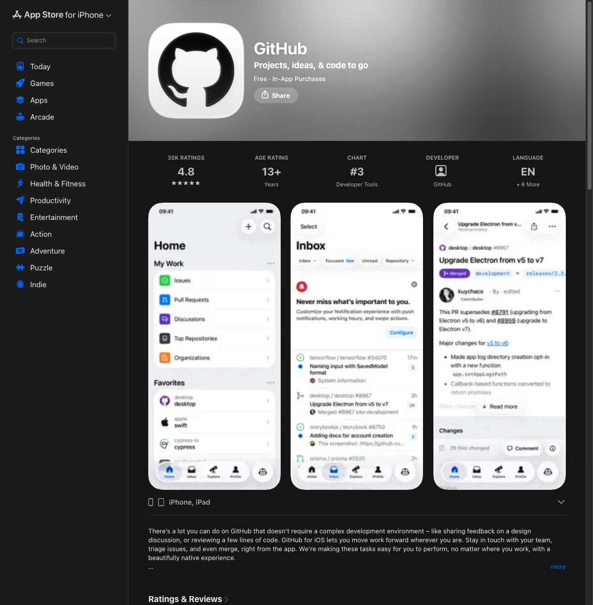 · 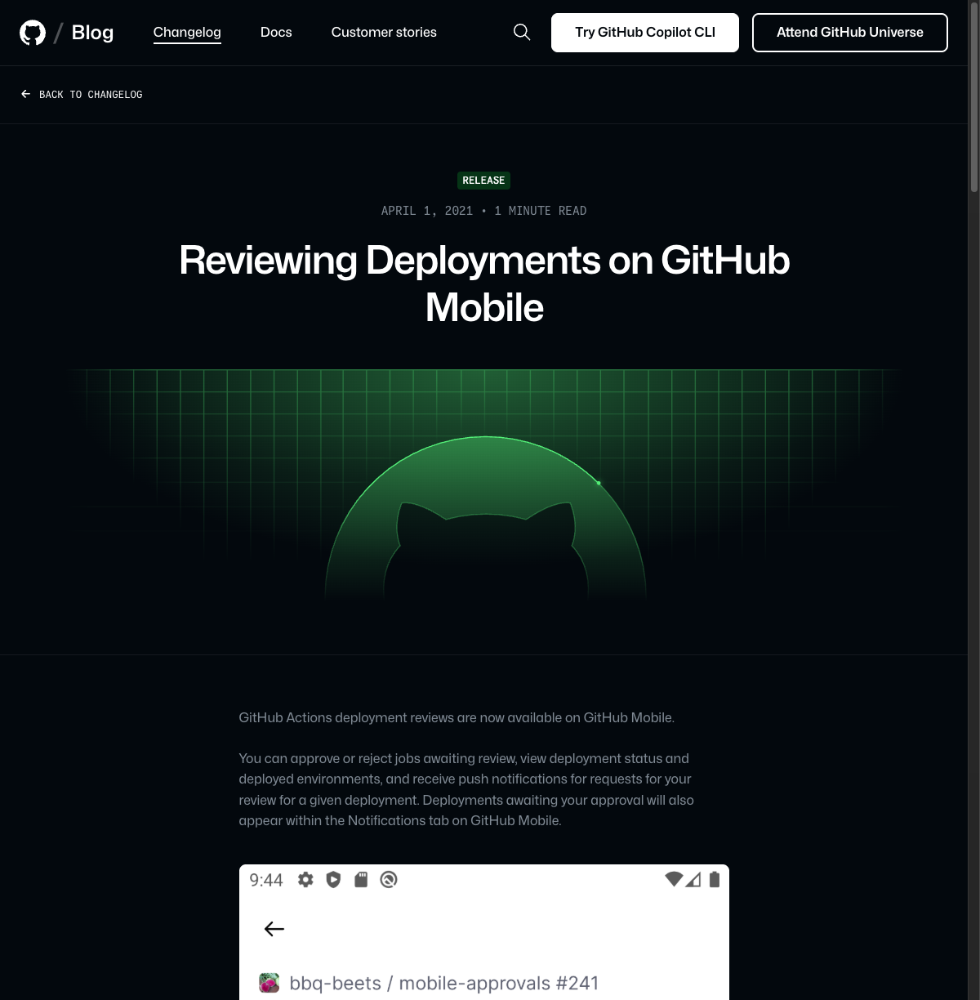

**Steal:**
- Push notification for a deployment-review request deep-links straight into the **exact review dialog** — environment(s) listed, Approve / Reject buttons, no navigation detour. This is precisely app-box's "gate goes red → tap → gate card with rendered surface + Approve/Reject."
- Per-**notification-category scheduling** (choose which event types may push, and when) — app-box should let the founder silence "build succeeded" but never "gate red."
- Known gap to beat: approval is only reachable *via the notification* in some flows ([community #110751](https://github.com/orgs/community/discussions/110751)) — app-box's gate queue must be a first-class in-app list, not notification-only.

**Why it suits app-box:** It is the founder's existing mental model for "walked away, phone buzzes, approve the deploy." Matching its zero-friction depth (notification → decision in two taps) while adding the rendered-design preview is the whole product thesis.

---

## 2. Linear mobile — the current craft benchmark for dev-tool mobile apps

- **URL:** https://linear.app · [Mobile app redesign — changelog, 2025-10-16](https://linear.app/changelog/2025-10-16-mobile-app-redesign)
- **Gallery:** [Linear changelog imagery](https://linear.app/changelog/2025-10-16-mobile-app-redesign) · [design interview w/ Linear mobile designer Gavin Nelson](https://spaces.is/loversmagazine/interviews/gavin-nelson)
- **Grade:** 🔥 (full visual redesign shipped Oct 2025)
- **Screens:** 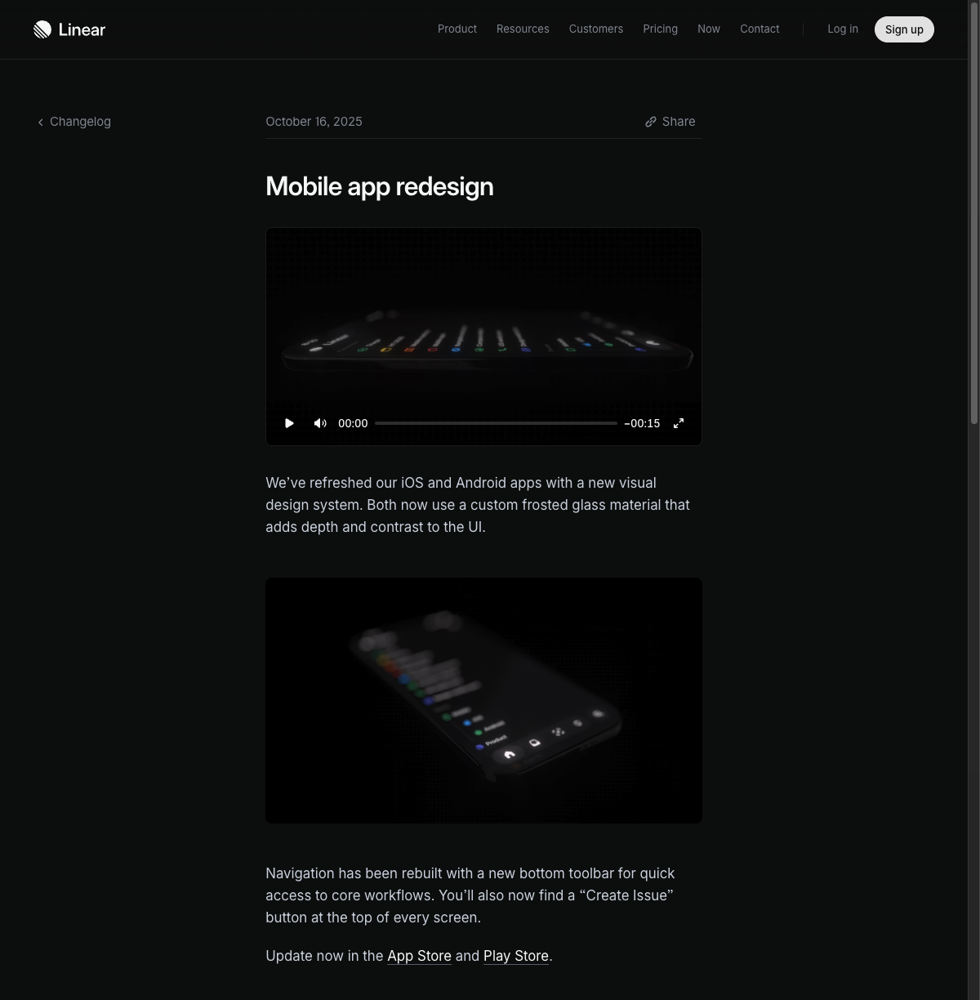 · 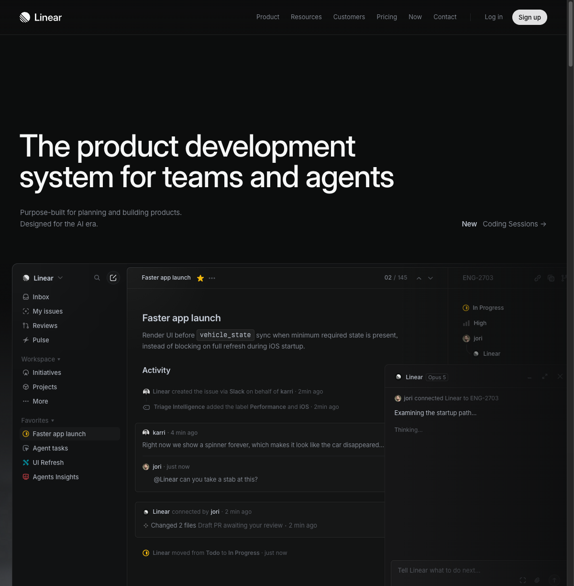

**Steal:**
- Custom **frosted-glass material** used with discipline — depth behind navigation and sheets, never behind content. app-box's gate cards and preview chrome should feel this expensive.
- **Triage inbox as the home screen**: a queue of items each demanding exactly one decision, with fast keyboard-free gestures. app-box's gate queue *is* a triage inbox — steal its information hierarchy (title, project chip, age, one-line context, actions).
- Motion language: sub-200ms springs, no gratuitous animation — speed reads as polish.

**Why it suits app-box:** Linear proves a developer tool can be the best-designed app on the phone. It's the direct answer to the founder's "too mediocre" bar: native feel, opinionated restraint, dark-first theming.

---

## 3. Expo Orbit + Expo Go — daemon↔device pairing and menu-bar ops done by our neighbors

- **URL:** [github.com/expo/orbit](https://github.com/expo/orbit) · [Homebrew cask (v2.8.0 current)](https://formulae.brew.sh/cask/expo-orbit)
- **Gallery:** [repo README screenshots and GIFs](https://github.com/expo/orbit)
- **Grade:** 🔥 (actively maintained, 2025–2026 releases)
- **Screens:** 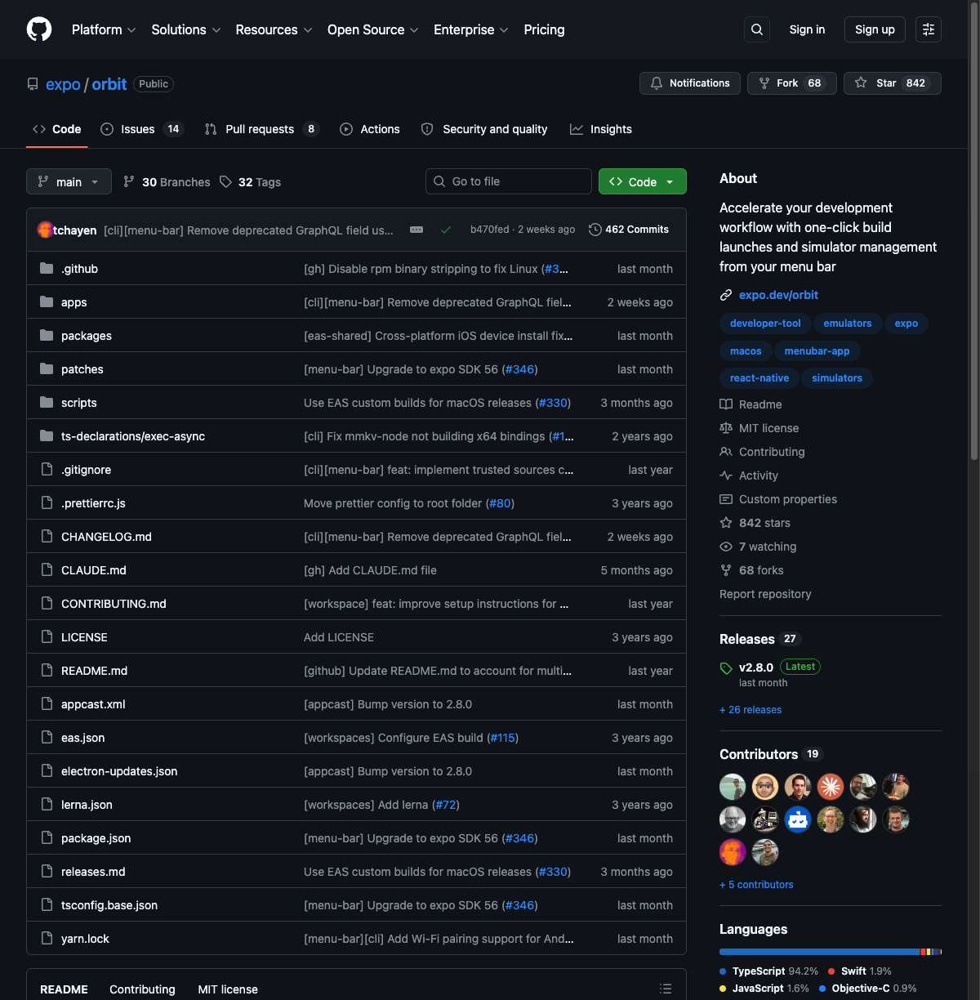

**Steal:**
- **Menu-bar app as the ops surface** (Orbit): one-click launches, recent-item list, status at a glance, zero window management. app-box's macOS shell should live in the menu bar by default, window optional.
- **QR → on-device handshake** (Expo Go): scan a QR rendered by the local dev server, phone joins the session over LAN, no account. The exact shape of app-box's pairing — QR contains daemon address + cert fingerprint; scan = pair + pin in one gesture.
- Device/simulator list grouped by platform with per-item actions — model for app-box's paired-devices list.

**Why it suits app-box:** Orbit is the closest existing analog to "local daemon driving native builds with a polished Mac presence," and Go's QR flow proves developers already trust camera-scan pairing for local tooling.

---

## 4. Datadog mobile — ops home screen, widgets, and glanceable system state

- **URL:** [docs.datadoghq.com/mobile](https://docs.datadoghq.com/mobile/) · [mobile widgets post](https://www.datadoghq.com/blog/datadog-mobile-widgets/)
- **Gallery:** [docs screenshots](https://docs.datadoghq.com/mobile/) · [setup guide imagery](https://docs.datadoghq.com/mobile/guide/setup_mobile_device/)
- **Grade:** 🌡️ (feature-rich, docs current to 2026-06; visuals competent not celebrated)
- **Screens:** 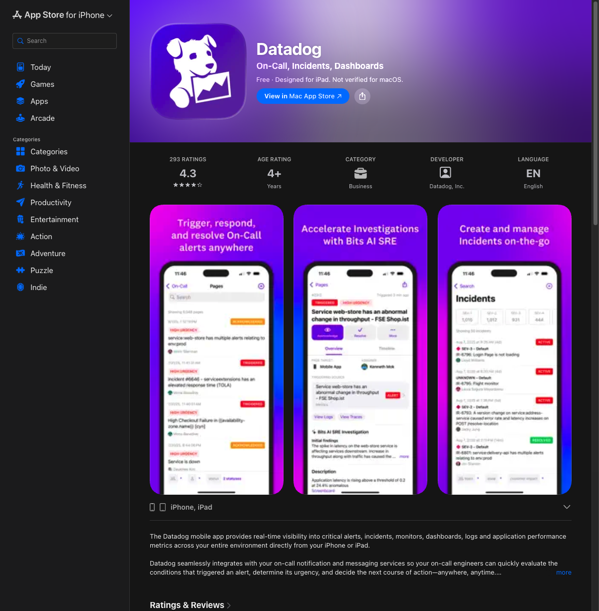 _(capture note: docs.datadoghq.com unreachable — DNS failure from this machine; captured the official App Store gallery instead)_

**Steal:**
- **Home-screen and lock-screen widgets** for monitor/incident status — app-box needs a widget showing current pipeline state (building / gate-red / idle) so the founder doesn't even open the app.
- Severity-colored incident list with saved views; the red state is unmistakable at 2 meters.
- Monitor detail = big status, sparkline, "mute for N hours" — app-box gate cards want the same "see it, judge it, act on it" density.

**Why it suits app-box:** Datadog owns "I am away from my desk but responsible for a running system" — the founder's exact posture during autonomous builds. Its widget strategy is the cheapest polish win on this board.

---

## 5. PagerDuty — acknowledge-from-anywhere muscle memory

- **URL:** [PagerDuty mobile app docs](https://support.pagerduty.com/main/docs/mobile-app)
- **Gallery:** docs screenshots at the same URL
- **Grade:** 🌡️ (patterns 🔥 — acknowledge UX is still the industry reference; visuals ❄️-leaning vs Rootly/incident.io)
- **Screens:** 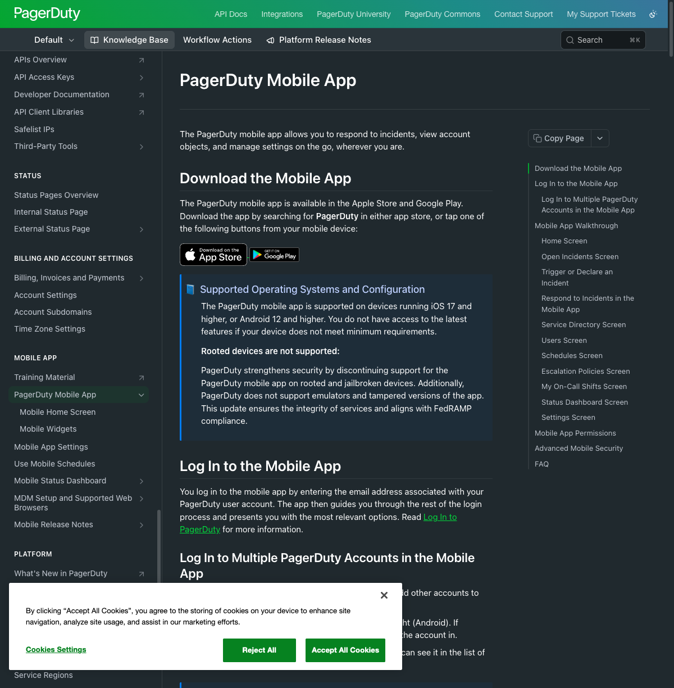

**Steal:**
- **Three redundant acknowledge paths**: swipe-left → Ack on the list row; detail-view button; **long-press the push notification → Ack** without opening the app. app-box must support notification actions (Approve/Reject from the banner) for gates flagged "safe to decide blind."
- Acknowledged vs resolved vs escalated are visually distinct states — app-box gates need the same lifecycle clarity (pending → approved → running → green).
- Escalation copy: "if you don't ack, X happens at T" — app-box should surface what the daemon does when a gate times out.

**Why it suits app-box:** It proves one-tap decisions from a notification are safe *when the action is scoped and reversible-looking* — and warns us (via its dated UI) that workflow correctness without craft doesn't hit the bar.

---

## 6. Raycast (macOS + iOS) — the macOS polish ceiling, now with a phone companion

- **URL:** https://raycast.com · [Raycast for iOS — blog, 2025-04-30](https://www.raycast.com/blog/raycast-for-ios) · [The Verge coverage](https://www.theverge.com/apple-ios/658265/raycast-ios-launcher)
- **Gallery:** [raycast.com](https://raycast.com) hero + extension store imagery
- **Grade:** 🔥 (iOS app shipped Apr 2025; macOS app is the standing reference)
- **Screens:** 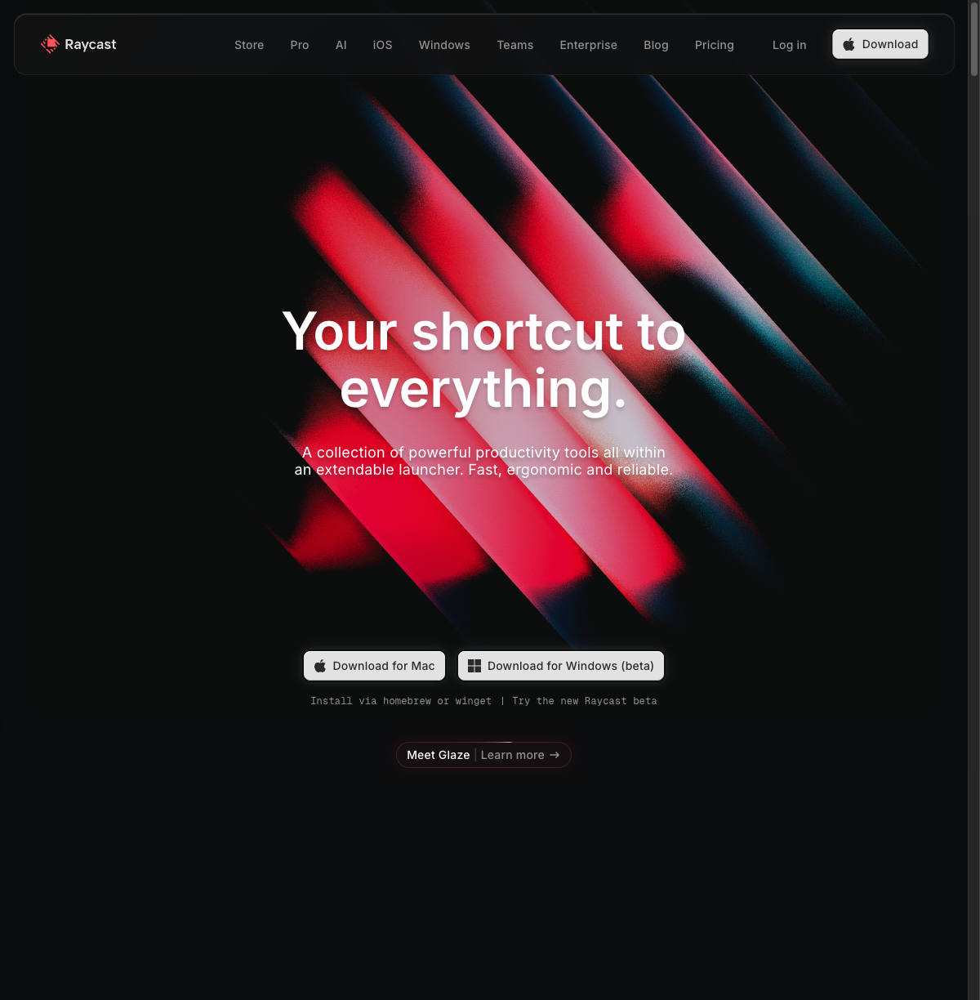 · 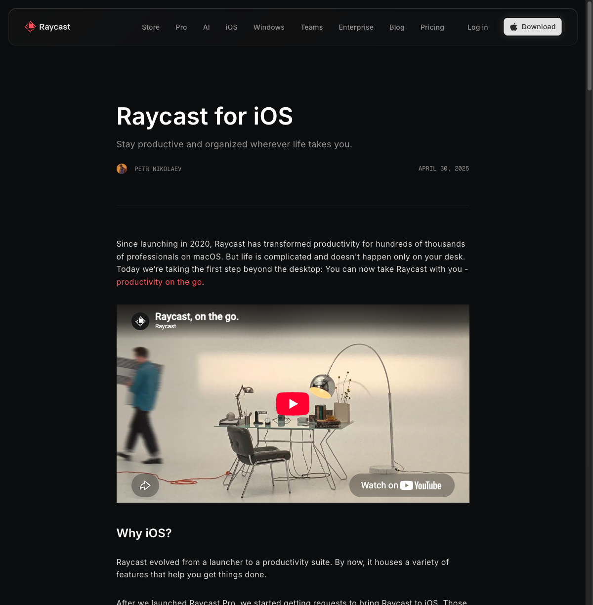

**Steal:**
- **Command-bar ergonomics**: every action reachable by fuzzy search with keyboard-first navigation and visible shortcuts — app-box's macOS shell should open on a command bar ("approve", "retry gate", "open preview").
- Root-level **menu-bar extras** with live status and inline actions.
- On iOS: AI/companion mapped to the Action Button — app-box should map "open gate queue" to Action Button / lock-screen control.
- Typography and spacing discipline: dense lists that still breathe; nothing is ever misaligned.

**Why it suits app-box:** Raycast *is* the polish tier the founder named. Its Mac↔iOS split (heavy lifting on Mac, ambient access on phone) mirrors app-box's daemon↔companion architecture.

---

## 7. Screen Studio — macOS-native craft as the product

- **URL:** https://screen.studio
- **Gallery:** [screen.studio](https://screen.studio/) hero videos + feature sections
- **Grade:** 🌡️ (actively sold, gold-standard reputation; no radical 2025-26 redesign)
- **Screens:** 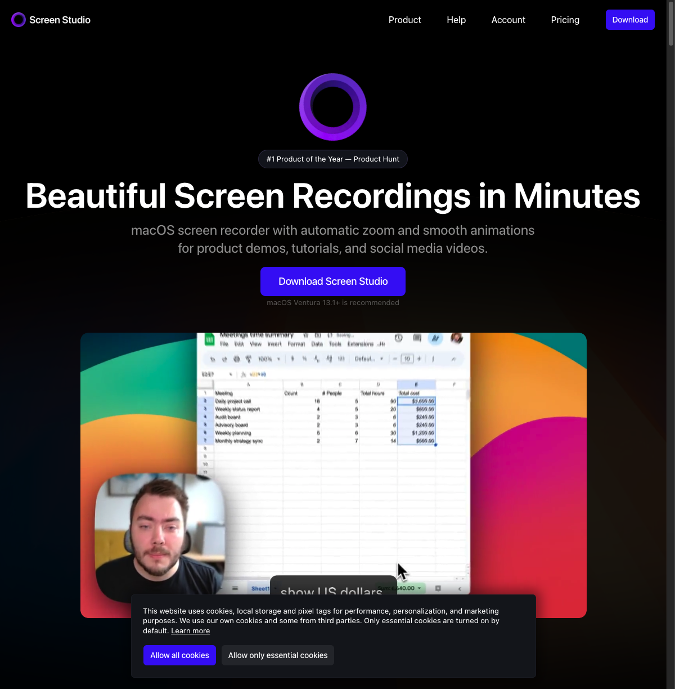

**Steal:**
- **Sensible defaults that produce a beautiful result with zero configuration** (auto-zoom, padding, background) — app-box's rendered-design preview should look presentation-grade with no settings: device frame, soft shadow, branded backdrop.
- **Custom chrome throughout** — every panel, slider, and tooltip is bespoke yet feels more Mac than the Mac. License for app-box to invest in custom gate-card and preview chrome rather than stock controls.
- One-window focus: the app does one thing, full-bleed, no chrome clutter. The preview surface in app-box deserves the same full-bleed treatment.

**Why it suits app-box:** Proof that an indie-scale Mac app can out-polish Apple. Its marketing *is* its UI — the same "show the rendered artifact beautifully" instinct app-box needs for design previews.

---

## 8. Apple TestFlight — build distribution and install trust UX

- **URL:** https://developer.apple.com/testflight · [App Store](https://apps.apple.com/us/app/testflight/id899247664)
- **Gallery:** App Store screenshots at the same URL
- **Grade:** 🌡️ (Apple-owned, evolves slowly, universally understood)
- **Screens:** 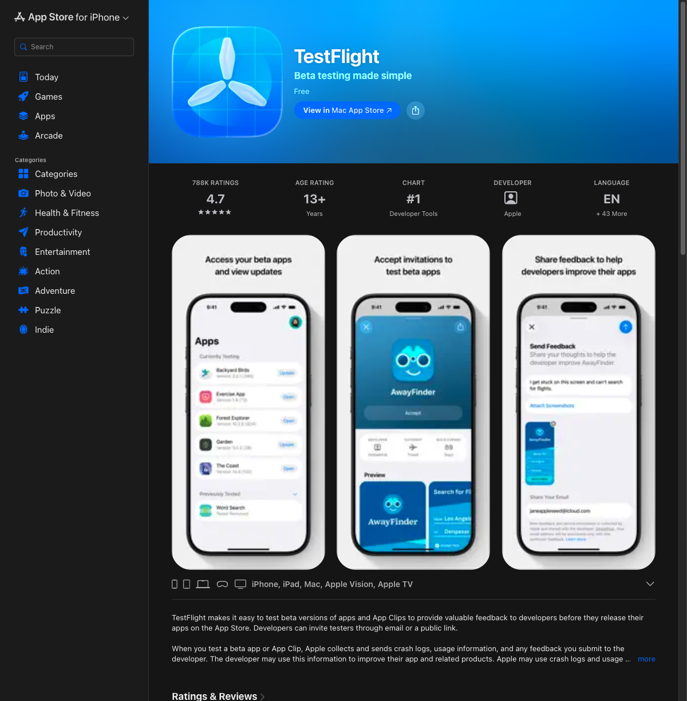

**Steal:**
- **Build row = version, age, expiry, "What's New"** — app-box's build list needs exactly this tuple plus the gate verdict that minted it.
- **Install/Update as the single dominant action** per build; everything else is metadata.
- Expiry and state badges ("expires in 83 days") — app-box artifacts should carry freshness/expiry just as visibly.
- Redeem-code onboarding — a fallback when QR scanning fails (camera broken, headless Mac): "enter this 8-char code instead."

**Why it suits app-box:** The indie-dev evaluator already knows this flow cold; matching its build-list grammar makes app-box feel instantly legible, and its code-entry fallback covers the QR edge cases.

---

## 9. WhatsApp Linked Devices — QR pairing and the paired-devices list, done for 2B users

- **URL:** [How WhatsApp enables multi-device (Meta Engineering)](https://engineering.fb.com/2021/07/14/security/whatsapp-multi-device/) · [passkey device linking in development (WABetaInfo, 2026-06)](https://wabetainfo.com/whatsapp-is-working-on-passkey-device-linking-for-android/)
- **Gallery:** imagery in the Meta Engineering post; linked-devices UI documented at the same sources
- **Grade:** 🔥 (flow still evolving — passkey pairing landing 2026)
- **Screens:** 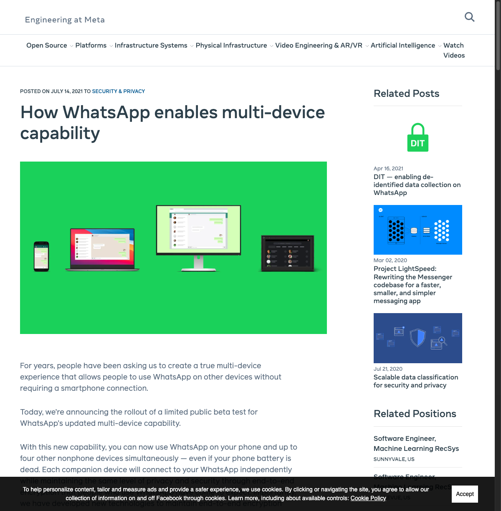

**Steal:**
- **Biometric gate before linking**: the phone demands Face ID before it will pair a new device — app-box pairing should require device unlock so a stolen-unlocked session can't mint approvers.
- **Paired-devices list with last-seen timestamps and tap-to-logout** ("Last active today at 09:41") — the swipe/tap-to-revoke list app-box needs verbatim, plus cert-fingerprint display for the paranoid.
- **Phone-number pairing code as QR alternative** (8-char code) — second vote for a code-entry fallback.
- Session death is loud and reversible: relink is one scan, not a support ticket.

**Why it suits app-box:** This is the most user-tested QR-pairing flow on earth. app-box's "only a paired human device can mint Approve/Reject" is WhatsApp's trust model with a LAN cert pin instead of the cloud.

---

## 10. Tailscale device approval — the admin-approves-the-device trust gate

- **URL:** [Device approval docs](https://tailscale.com/docs/features/access-control/device-management/device-approval) · [add a device](https://tailscale.com/docs/features/access-control/device-management/how-to/set-up)
- **Grade:** 🔥 (docs validated 2026-01; flow is the current zero-trust reference)
- **Screens:** 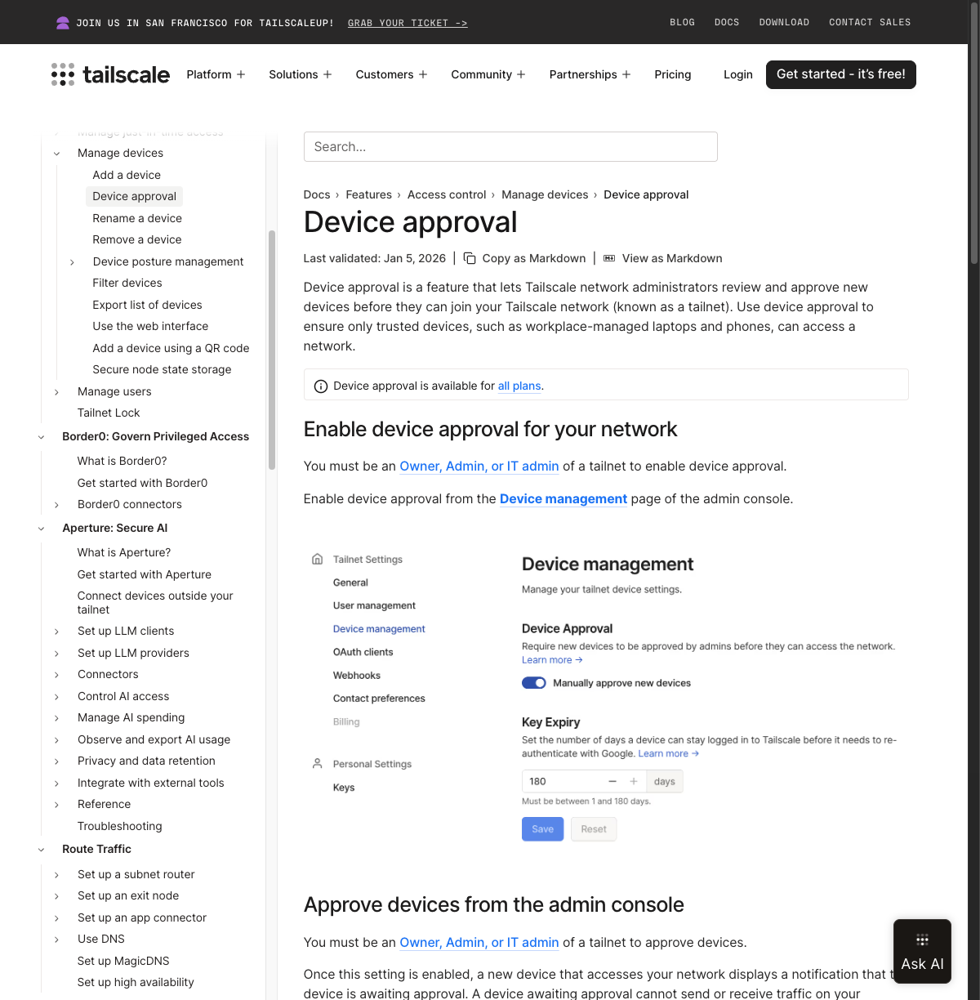

**Steal:**
- **New device connects but is inert until approved** — "awaiting approval" banner on the device, pending row at the top of the Machines list for the admin. app-box: a newly paired phone can *view* but cannot Approve/Reject until an already-paired device (or the Mac shell) confirms it. Two-device bootstrap for the first phone, vouching for every phone after.
- **Pre-approved auth keys** as the power-user path — app-box can issue a one-time pairing token from the CLI for scripted/headless setup.
- Machine list columns: name, user, OS, last seen, expiry — same schema as pattern #9, reinforcing the convention.

**Why it suits app-box:** It answers the threat WhatsApp doesn't: QR alone shouldn't confer approval power if someone photographs the QR. Human-confirms-new-device is the difference between "paired" and "trusted to mint approvals."

---

## Honorable mentions (patterns worth one line each)

- **Things 3** — 🌡️ the haptic + spring-physics standard; steal the satisfying "done" check-off feel for gate approval.
- **Craft** — 🌡️ document-craft benchmark; steal its inline media rendering quality for the rendered-design preview cards.
- **Cron / Notion Calendar** — 🌡️ menu-bar mini-panel with "next thing + join in one click"; model for app-box's menu-bar "next gate + open."
- **CleanShot X** — 🌡️ post-capture quick-access overlay; model for app-box's floating "gate resolved" toast with undo.
- **Vercel** — ❄️ cautionary: no first-party mobile app (web dashboard only, community begs for widgets) — evidence the "dev platform without a real companion" gap app-box fills is real.

---

## Patterns app-box must have — top 10

1. **Push → deep-link into the exact gate card**: notification opens the gate with rendered surface + Approve/Reject inline; decision in ≤2 taps (GitHub Mobile).
2. **Actionable notifications**: long-press banner → Approve/Reject without opening the app, for gates marked safe-to-decide-blind (PagerDuty).
3. **Gate queue as triage inbox**: home screen is a severity-colored queue of pending decisions — title, project, age, one-line context, lifecycle states pending→approved→running→green (Linear + PagerDuty).
4. **Fullscreen presentation-grade preview**: rendered design fills the screen with device frame, soft shadow, branded backdrop, zero configuration (Screen Studio + Craft).
5. **Channel-state dot**: persistent live/reconnecting/dead indicator on every screen; reconnecting is a designed state with backoff copy, not a spinner of doom (Datadog status grammar).
6. **QR pairing = pair + cert-pin in one scan**, biometric-gated on the phone, with an 8-char code-entry fallback for broken cameras/headless Macs (WhatsApp + TestFlight).
7. **Paired-devices list**: name, platform, cert fingerprint, last-seen, swipe-to-revoke; revoke is instant and relink is one scan (WhatsApp + Tailscale machine list).
8. **Human-confirms-new-device**: freshly paired phones can view but not approve until vouched by an existing trusted device or the Mac shell (Tailscale device approval).
9. **Menu-bar-first macOS shell**: live pipeline status, next-gate preview, inline actions; full window is optional; command bar for "approve / retry / open preview" (Expo Orbit + Raycast + Cron).
10. **Ambient awareness surfaces**: iOS/Android home-screen widget + lock-screen/Live Activity showing pipeline state (building / gate red / idle) so the decision finds the founder, not vice versa (Datadog widgets + Raycast iOS Action Button).
