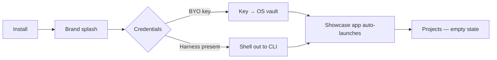
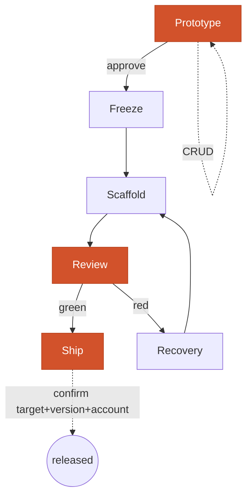

# app_box — design brief

**Owner:** Totem Labs — parent company.
**Founder:** Evan F Pierre Louis.
**Product:** app_box, a desktop application that takes a client conversation to
a shipped, bespoke Flutter app in opinionated Stacked MVVM — designed, gated,
scaffolded and deployed, with the human holding the irreversible decisions.

This brief is the **input to `app-box-designer`**. It is written to be
prototyped, not admired: the surface inventory below seeds `registry.json`
(see `architecture.md` §14), and the journeys define the states each surface
must have.

**Dogfood target:** macOS desktop, `--targets macos` → one viewport
(§16 — three layout files, not five).

---

## 1. Personas

Full treatment in `architecture.md` §1. In short: **P1** client-intake, **P2**
autonomous-build, **P3** red-gate recovery, **P4** ship, **P5** the buyer —
a solo dev or a small agency who is not the founder and has no context.

P5 is the one this brief must serve without explanation. Every surface should
be legible to someone who has never read any of these documents.

---

## 2. The journeys

### J1 — First run

The showcase app launching on first run *is* the demo: it proves the output
quality before the buyer has typed anything. Credential tier is stated plainly
on screen — *"stored in the macOS Keychain"* (research: `remote-control-and-chat.md`).

### J2 — New project

Intake → name, brand, **targets** (§11: platform only; viewports derive) →
design brief. Targets chosen here are written to pipeline state and are what
every later gate reads.

### J3 — Design *(HUMAN GATE 1)*

Prototype in htmx, three directions, iterate. The person approves **one**
direction. An agent may prepare and present; it cannot mint the approval.

### J4 — Freeze

Six frozen inputs, render gate, structure gate. Output: a pass/fail report the
person can read, findings as SARIF.

### J5 — Build *(HUMAN GATE 2)*

Scaffold against real kits. Gates run. Red gates route to **P3 recovery** —
the finding, the file, the line, and what would change.

### J6 — Ship *(HUMAN GATE 3 — the strictest)*

Names **target, version and account**, and requires the person to confirm that
exact triple. Every other gate is a read-only assertion; this one writes to the
outside world and cannot be undone by re-running a stage.

### J7 — Remote

Pair the phone by QR → drive the pipeline → **Serve prototype** → fullscreen
WebView with the state-bearing FAB (§15).

### J8 — CRUD a feature

See §18 of `architecture.md`. Editing happens on the registry and the
view/viewmodel pair, never on scaffolded Dart.

---

## 3. The full loop

Orange = a human gate. Three of them, and no path reaches `released` without
passing the third.

---

## 4. Surface inventory — the registry seed

One `stage_shell` with tabs, matching the htmx producer's own convention.

| id | tab | surface | states to design |
|---|---|---|---|
| `projects.home` | projects | `stage_shell_projects_home_view` | empty · list · loading |
| `projects.new` | projects | `stage_shell_projects_new_view` | form · validating · error |
| `design.directions` | design | `stage_shell_design_directions_view` | 3-up · one approved |
| `design.surface` | design | `stage_shell_design_surface_view` | live preview · stale |
| `design.approve` | design | `stage_shell_design_approve_view` | **gate 1** — pending · approved |
| `build.run` | build | `stage_shell_build_run_view` | idle · running · green · **red** |
| `build.finding` | build | `stage_shell_build_finding_view` | file · line · rule · fix |
| `build.approve` | build | `stage_shell_build_approve_view` | **gate 2** |
| `ship.targets` | ship | `stage_shell_ship_targets_view` | fastlane · shorebird · CF Pages |
| `ship.confirm` | ship | `stage_shell_ship_confirm_view` | **gate 3** — the triple |
| `chat.home` | chat | `stage_shell_chat_home_view` | idle · streaming · tool-call |
| `settings.credentials` | settings | `stage_shell_settings_credentials_view` | vault tier stated |
| `settings.devices` | settings | `stage_shell_settings_devices_view` | paired · revoke |
| `settings.kits` | settings | `stage_shell_settings_kits_view` | wired vs **stubbed** |

`settings.kits` earns its place from `stub-inventory.md`: 5 of 23 kits are
partial and several providers throw. A buyer who picks Stripe and discovers
`UnimplementedError` at build time has been misled — the surface must show
wired-versus-stub honestly.

---

## 5. Non-negotiables for whoever designs this

1. **Red must mean broken.** The licence check is a precondition, not a gate
   (§17). Nothing goes red for money.
2. **No state is inferred from paint.** The FAB, the build view and the
   prototype viewer all show *channel* state, never "did it render."
3. **Stubs are labelled.** Never offer a target that throws.
4. **The three gates are visually distinct** from anything an agent can do
   alone. Approval is the product's core claim; it should look like it.
5. **Empty states carry wording.** The htmx experiment found empty-state copy
   simply absent, and the generator invented it. Design it here instead.
