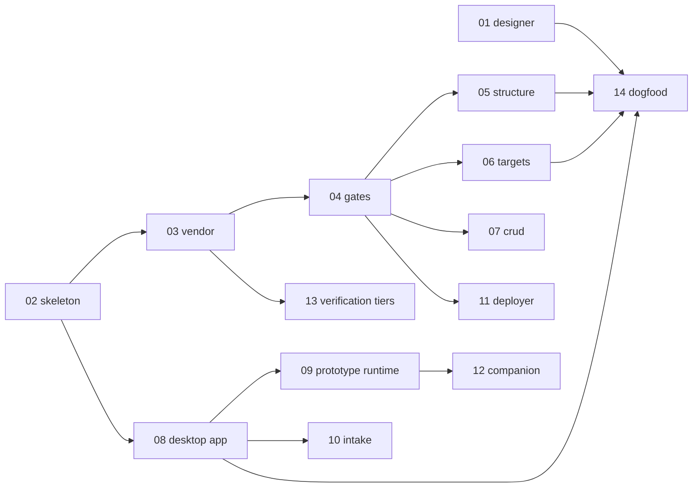

# Execution contract — read this before any plan

You are a builder agent. **You execute; you do not design.** Every architectural
decision is already made and recorded in `../architecture.md`. If a step is
ambiguous, **stop and report** — do not choose.

## The five rules

### R1 — Copy, do not write

Almost everything already exists. Each plan names **exact source paths**. Your
default action is `cp` followed by a rename pass, not authoring. If you find
yourself writing a function from scratch, you have probably missed the source —
stop and check the plan's *Source* table.

### R2 — No references to the repos we ported from

app_box is a product, not a fork that reads like one. After copying, **strip
every operational reference** to `flutter-crew`, `kimi-design`, `kimi-design-htmx`,
`baoyu`, `huashu`, `p2`, `asko` from: module names, function names, file paths,
CLI help text, log strings, doc cross-links, skill names, config keys.

**Three exceptions you must NOT strip:**

1. **Licence and copyright notices.** `kimi-design-htmx` is MIT
   (*Copyright (c) 2026 Jim Liu 宝玉*). Retaining the licence and notice is a
   legal condition of use. Put them in `THIRD-PARTY-NOTICES.md` and keep any
   `LICENSE` file that came with copied code.
2. **Genuine runtime dependencies.** `stacked_kit` packages that a scaffolded
   app actually depends on stay named — they are real deps, not stale
   references.
3. **Historical citations inside `docs/research/`.** That is a record of what
   was measured, and rewriting it would falsify it.

### R3 — No hardcoding

No absolute paths, no magic numbers, no embedded strings that vary by project.
Everything configurable comes from **pipeline state** or a config file. If you
need a value and there is no config key, add the key — do not inline the value.

Freeze widths, targets, viewports, kit SHAs, ports: all config. Never literals.

### R4 — One folder per gate; gates do not import each other

```
gates/<gate-name>/
  <gate-name>.sh | .py | .dart    the gate
  selftest.<ext>                   its own suite
  README.md                        what it asserts and why
```

A gate reads state and files, asserts, and exits `0` or `1`. It **never** calls
another gate, and never imports from a sibling gate folder. Shared helpers go in
`gates/_common/`. If two gates need the same logic, it moves to `_common` — it
does not get imported sideways.

### R5 — Every gate must be able to fail

A gate that cannot go red for the right reason is not a gate. Each gate's
selftest **must include a negative case**: plant the defect, assert the gate
exits `1` and names the offending file. A selftest that only proves the happy
path is rejected at review.

Assert regenerated output with `git status --porcelain`, **never**
`git diff --exit-code` — a generator that *adds* a file is the expected case and
`git diff` cannot see untracked files.

## How to run a plan

1. Read the whole plan before starting.
2. Work the steps **in order**. Each is independently verifiable.
3. Tick the checkbox in the plan file as you complete each step, and commit that
   tick with the work.
4. Run the plan's **Done-when** assertions. All must pass.
5. Report: steps completed, assertions passing, anything you stopped on.

## Commit format

Single line, no author mentions, no co-author trailers.

```
feat(designer): fork the MIT htmx skill and strip upstream references
```

## Dependency graph



**Parallel from the start:** `01` and `02` have no dependency on each other.
`01` is the priority — the founder is blocked on it and starts designing the
moment it lands. Everything downstream of `02` can proceed simultaneously.

## Status

| plan | owner | done |
|---|---|---|
| 01 designer | | ☐ |
| 02 repo skeleton | app-box | ☑ |
| 03 vendor tooling | app-box | ☑ |
| 04 gates | app-box | ☑ |
| 05 structure + registry | | ☐ |
| 06 targets in state | | ☐ |
| 07 CRUD + delete | | ☐ |
| 08 desktop app | app-box | ☑ |
| 09 prototype runtime | | ☐ |
| 10 intake | | ☐ |
| 11 deployer | | ☐ |
| 12 companion | | ☐ |
| 13 verification tiers | app-box | ☑ |
| 14 dogfood | | ☐ |
