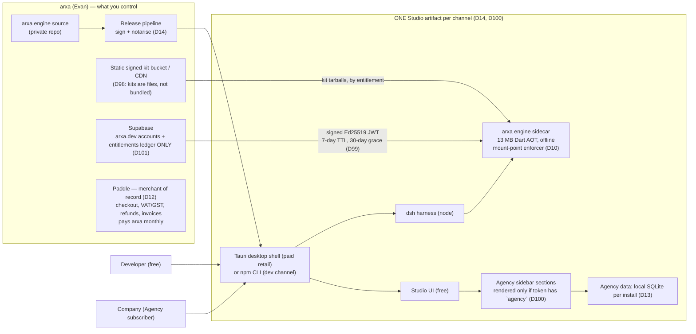

# arxa distribution, Studio, Agency, money and entitlements — one picture

Date: 2026-09-02. Encodes decisions D10, D12, D13, D14, D15, D98, D99, D100, D101
(`arxa-studio/docs/plans/arxa-studio-grill-decisions.md`). Renders in VS Code / GitHub
(Mermaid). Change the decision first, then the picture.

## 1. Who gets what



What never leaves your side: engine source, signing keys, the kit bucket's signing key,
the Ed25519 private key that signs entitlement tokens. What ships to everyone: the compiled
engine, the whole Studio UI including the gated Agency sections. Enforcement is the token,
not secrecy (D12 "inherently crackable").

## 2. How money becomes an entitlement

```mermaid
sequenceDiagram
  autonumber
  participant U as User / Company
  participant S as Studio (same binary)
  participant P as Paddle (MoR)
  participant F as Supabase edge fn (one webhook handler)
  participant L as Supabase entitlements ledger
  participant A as /activate (signs JWT)
  participant E as Engine enforcer

  U->>S: sign in with arxa.dev account (required before purchase)
  S->>U: opens SYSTEM BROWSER at arxa.dev/checkout?price=…&uid=… (D105)
  U->>P: arxa.dev page runs Paddle.js overlay; Paddle collects card, VAT/GST, invoice
  P->>F: webhook: transaction.completed / subscription.updated / cancelled
  F->>L: upsert entitlement rows (kit tier, agency, seats, expiry)
  P-->>U: checkout.completed → page redirects to arxa://checkout/done
  S->>A: poll /activate after deep link (and on token <48 h left)
  A->>L: read entitlements for user
  A-->>S: Ed25519 JWT {tiers, agency, exp}
  S->>E: token
  E->>E: verify offline; unlock kits / Agency mode; 30-day grace after exp
```

Rules encoded here:
- Paddle is the only place money moves (D15). arxa.dev never sees a card.
- One webhook handler, one ledger table. The two existing migration trees that both write
  `subscriptions` are reconciled into this one first (D101).
- Cancellation/refund reaches the customer at the next refresh; worst case = TTL + grace
  (7 + 30 days). Accepted in D99.
- Agency mode is just another claim in the same token (D100). No second login, no second
  artifact.

## 3. What Supabase is NOT (D101)

- Not the Agency's database. Company data stays in local SQLite; a remote adapter is a
  later, separate decision with its own tenancy/RLS design.
- Not a kit server. Kits come from the static signed bucket (D98).
- Not a payment mirror beyond what the webhook writes. Paddle's dashboard is the
  accounting system of record; Paddle's payouts page is the revenue report.

## 4. What is sold, on which axis (D104, D107)

| SKU | Unit | Buys | Paddle shape |
|---|---|---|---|
| Free | — | intake, design, eject; anonymous, local | none |
| Pro | per developer seat | scaffold and every stage after | subscription, `quantity = seats` |
| Scale | per org flat + per released app; installs prepaid in packs | app-fleet volume, org-wide scaffold, unlimited seats — replaces Pro seats | subscription qty 1 + per-app price; install packs as one-time charges, auto-buy opt-in |
| Agency | per member seat (org owner buys quantity) | business/admin sections (`agency` claim) | subscription, `quantity = seats`; 14-day card trial |
| Pro+Agency | per member seat | both of the above for one person | subscription, bundled price id |
| Viewer | free, uncounted | read-only: approvals, invoices, project status | none |
| Premium kits | one-time | a kit tier claim | one-time price |

Prices (USD, monthly / annual): Pro $29 / $24 · Agency $19 / $16 · Pro+Agency $39 / $32 · Scale $149 flat + $49 per app beyond 3 · install pack 25,000 for $15.
Agency sits beside the ladder: a Pro or a Scale customer can each add it (a Scale org pays the plain Agency price — no bundle, scaffold is already org-wide).

## 5. Provider switch condition (D12)

If the seller-of-record entity ends up Australian or EU **and** Stripe confirms Managed
Payments eligibility, box "Paddle" above becomes "Stripe Managed Payments" and nothing else
in the picture changes — the webhook handler is the only code that knows which MoR it is.
A Mauritius entity keeps Paddle. Details:
`mor-provider-comparison.md`.
