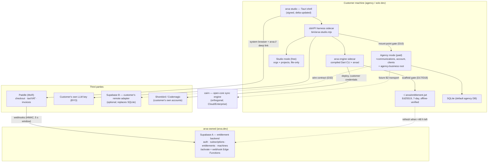

# Strategy digest — distribution, engine, agency, payments (2026-09-02)

Purpose: one page that says what is **already decided**, where it is written, what
**contradicts** it, and the exact questions the grilling session must resolve.
Inputs: `local-docs-digest.md`, `security-research.md` (both in this folder),
the arxa research set (`competitors-and-pricing.md`, `monetization-and-licensing.md`,
`entitlement-enforcement-practices.md`, `paygate-packaging-precedents.md`,
`scale-pricing-and-credits.md`, `distribution-protection-inventory.md`,
`engine-decision-digest.md`), `docs/plans/monetization-and-entitlements.md`,
`docs/plans/consolidate-one-app-plus-daemon.md`, `arxa/CONTEXT.md`,
`arxa-studio/docs/plans/arxa-studio-grill-decisions.md` (D1–D91),
`cairn/docs/adr/0006-*.md`, and the engine code under `arxa/arxa/lib/`.

## 1. What is already decided (and where)

| Topic | Decision | Source |
|---|---|---|
| Positioning | Against FlutterFlow's per-seat pricing and one-way export trap. Agencies = persona P5. BYO-LLM key means arxa carries no inference cost → flat licence, never metered, never per-seat. | `competitors-and-pricing.md`; consolidate plan #11 |
| Product split | **Studio** (free, file-only, no Supabase) → **Agency** (paid upgrade: communications, account/client folders, client mgmt; Supabase lives here) → separate **agency-business root** (HR, accounting, vendors…) Studio never mounts. Launcher chooser: Studio or Agency. | studio D8 |
| Pay gate location | One entitlement check at the **mount point** in the harness; billing-driven entitlements, no scattered `if(paid)`; downgrade non-destructive. Engine side: paywall moved from deploy to **scaffold** (`scaffoldMain`, `scaffoldGate`). | studio D10; arxa D17/D18 |
| Money pipe | **Paddle or Lemon Squeezy as merchant of record**, single pipe for kit purchases + Agency subscription. `arxa.dev` holds entitlements only, never money. | studio D12, D15 |
| Pricing | Studio free; Pro ~$20–40/seat/mo unlocks scaffold; Scale $149/mo per org, 3 apps then $49/app; Agency subscription (price open); premium kits one-time $199–$599. | arxa D19/D30/D33; studio D15 |
| Accounts | Anonymous free, optional early link; purchase always creates an `arxa.dev` account. | studio D16 |
| Engine form | Compiled `arxa` Dart CLI + dsh/PI harness (`bin/arxa-studio.mjs`) **ship together as a bundled sidecar** inside a Tauri shell; `pack-sidecar.mjs` builds the self-extracting binary. One core, CLI + desktop channels. | studio D14, D30; `local-docs-digest.md` Q1 |
| Entitlement mechanics | `arxa login` → Supabase auth → `/activate` Edge Function → Ed25519 JWT (`sub`, `fpr`, `feat`, `exp`≈7d) cached at `~/.arxa/entitlement.jwt`, verified **offline** against a pinned key; refresh-not-heartbeat; grace on expiry; 3 seats. **Implemented**: `entitlement.dart` (392 l), `entitlement_refresh.dart` (516 l), `gate_scaffold.dart`. Licence file + env bypass retired. | `entitlement-enforcement-practices.md`; `gate_deploy.dart` header |
| Anti-pattern | "Licence-server dependency bricks the product" (Adobe CS3 precedent). Client DRM is a speed bump; design for "paying easier than pirating". Never encrypt emitted code. | `monetization-and-licensing.md` Verdict |
| Distribution protection | Repo private (only real control today); add root proprietary LICENSE + EULA; ship AOT with embedded assets; redistribution gate in the gate suite. | `distribution-protection-inventory.md` |
| Agency data | SQLite default, pluggable remote; Supabase is the first remote adapter; BYO backends via a wire contract, no foreign code in-app. | studio D13, D32 |
| Remote / cloud | No Totem Cloud at launch; remote = self-host or Tailscale; adding cloud later changes no client code. | consolidate plan #10 |
| Cairn | Orthogonal: open-core Apache-2.0 sync engine, Cloud + Enterprise monetization; no dependency on Supabase/Stripe/Paddle. | cairn ADR-0006; `local-docs-digest.md` Q6 |

## 2. The map

Read it as: **two Supabases with different owners** (A is arxa's ledger, B is the
customer's data), **one money pipe** (Paddle → Supabase A), and the **engine on the
customer's disk** gated by a token it can verify without the network.

## 2b. Measured install footprint (2026-09-02, from built sidecars on disk)

| Piece | Size | Source |
|---|---|---|
| Harness sidecar `desktop/src-tauri/binaries/arxa-studio-aarch64-apple-darwin` (bun-compiled) | 193 MB | embeds bun runtime, node-pty (26 MB), dsh, AI provider SDKs |
| Engine sidecar `desktop/src-tauri/binaries/arxa-aarch64-apple-darwin` (Dart AOT) | 13 MB | `.build/arxa` same size |
| Tauri shell | not built; est. 5–15 MB | `target/release` absent |
| Kit templates, git-tracked | 26 MB | `git ls-files kit`; `kit/` on disk is 2.2 GB of build junk (`showcase_app/build` 1.4 GB, vendored ios/macos ~680 MB, Pods 90 MB) |
| Total download as planned | ≈230–250 MB raw / ~100–130 MB compressed | comparable to Cursor; Flutter/Xcode/Android SDKs dwarf it |

Gaps found while measuring:
- **Kit is not distributed.** `pack-sidecar.mjs` payload = `bin/arxa-studio.mjs`, `bin/loopback-localhost-patch.mjs`,
  `profile/cordis.patch.yml`, `node_modules/@deepseek-ai/dsh/lib/bin.js` + node runtime. The engine
  resolves `kitRoot` from a source checkout (`gate_kind_registry.dart:68`). A customer install has no kit.
- **Linux not buildable.** `tauri.conf.json` `targets: ["app","dmg"]`, `externalBin` only aarch64-apple-darwin,
  no linux triple anywhere. Consolidate plan line 38 promises macOS/Windows/Linux.
- Size lever, if wanted, is the harness (193 MB), not the engine (13 MB). Hosting the engine would not reduce install size.

## 3. Contradictions to resolve in the grill

1. **Ship vs host — RESOLVED 2026-09-02.** Closed as local sidecar (A) + kits from a
   static signed bucket (B), hosted conveniences reserved (C), with four numeric revisit
   triggers. Full reasoning: `engine-distribution-options.md`. The user's concern turned
   out to be install size, which measured at 13 MB for the engine. `security-research.md`
   posture #1 (host the engine) is superseded.
2. **Stripe vs Paddle.** `docs/plans/monetization-and-entitlements.md` (Stripe mirror
   schema, Stripe webhook, Stripe Checkout, workstreams 1 & 7) vs studio D12/D15
   (Paddle/LS MoR). Code follows the plan (Stripe webhook function, `subscriptions`
   columns, seed data). User intent: Paddle first, Stripe possible later.
3. **Two Supabase migration trees write the same `subscriptions` table**
   (`local-docs-digest.md` Q5) — reconcile before a provider swap.
4. **Stale "what exists today"**: plan cites `licence.dart` / `watermark.dart`; neither
   exists; `gate_deploy.dart` says the licence file is retired.
5. **Agency price** not set anywhere (D15 says "Agency subscription", no figure).
6. **Air-gapped / offline-forever** flagged open in the plan; never answered.

Not a contradiction: 26 `stripe` hits in `arxa/arxa/lib/tier1.dart` are the
**scaffolded customer apps'** payment kit, unaffected by arxa's own billing choice.

## 4. Ship-vs-host — the three real options

| | A. Local sidecar (current D30) | B. Hybrid: local engine + server-served paid artefacts | C. Hosted engine (security report #1) |
|---|---|---|---|
| What's on customer disk | Whole compiled engine | Whole engine minus the paid "recipes"/kit bodies, fetched on entitlement refresh and cached with grace | Thin client only |
| Stops pirated paid scaffolds | Speed bump (AOT patchable) | Speed bump + revocable content | Yes |
| Hides engine internals | No (AOT is weak) | Partly (only what stays server-side) | Yes |
| Revoke a licence | On next refresh (≤7 d) | Same | Immediate |
| Offline paid scaffold | Yes | Yes within grace | No |
| Supabase outage / region block | Nothing stops | Cached copy carries on | Paid users blocked |
| Design uploads leave machine | Never | Never (only tokens) | Every generation |
| Ops burden (solo founder) | Edge Functions only | + one artefact endpoint | Production service, quotas, abuse, uptime |
| Reversible? | Can add B or C later, no client change | Can fall back to A | Cannot be un-hosted without redoing distribution |
| Contradicts | — | — | D30, consolidate #11, monetization verdict, free-tier promise |

Advisor recommendation (consult 2026-09-02, confidence 0.74): keep **A** as default,
offer **B** as the middle; **C** only if the answer to Q1 below is "engine internals are
the product and are not visible in the output".

## 5. Grill agenda (ordered; each question waits for an answer)

1. Which concrete loss is "control" preventing: pirated paid scaffolds, decompiled
   engine internals, or inability to revoke? (decides A/B/C)
2. Is the engine's unique value visible in the scaffolded output, or hidden in how it
   is produced? (moves B→C if hidden)
3. Longest acceptable offline window for a paid agency before scaffold stops.
4. Paddle now: which arxa-plan items get rewritten (schema `provider` columns, webhook
   handler, checkout flow), and is Lemon Squeezy still a candidate or is it Paddle only?
5. Agency access "only via the studio, never alone" — is that the D8 launcher chooser,
   or a runtime dependency (agency package refuses to start without studio)?
6. Agency subscription price and axis (per org, per seat, per client?).
7. Supabase B ownership: customer-provisioned, or arxa-provisioned via Supabase for
   Platforms (resold ~$39, `scale-pricing-and-credits.md` Q2)?
8. Reconcile the two `subscriptions` migration trees — which one survives.
9. Air-gapped path: out of scope, or manual signed-token file?
10. Signing identities (Apple Developer ID, Windows EV/Artifact Signing) — who owns them.

## 6. Doc updates owed once decisions land

- `docs/plans/monetization-and-entitlements.md`: Stripe → Paddle (or provider-agnostic),
  remove stale `licence.dart`/`watermark.dart` citations, record ship-vs-host outcome.
- `arxa/CONTEXT.md`: confirm "Engine" and "Stub skill" wording matches the outcome.
- `arxa-studio/docs/plans/arxa-studio-grill-decisions.md`: new D-entries for agency
  price, agency access rule, Supabase B ownership.
- ADR candidate (hard to reverse + surprising + real trade-off): ship-vs-host.
